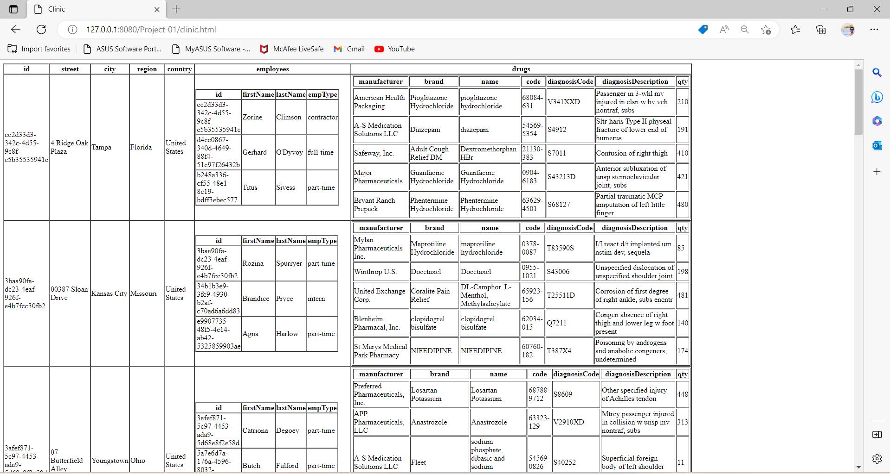

<!-- Name: Jaikumar Anilkumar Darji
    ID: n01561627
 -->
-Aalyze the xml file and it is complicated to represnt it because of lots of data in it.

-I have created html file from the xml file that diagramatically represent the dataset provided.
-Output of html file: 

-The major difficulty that I faced was based on table in table representation for that I have to using javascript and creating a loop inside loop to show all the data in table and load it from the xml file.

-I used loop so it continously and display all the data by incrementing one by one and displaying in Rows and columns.

