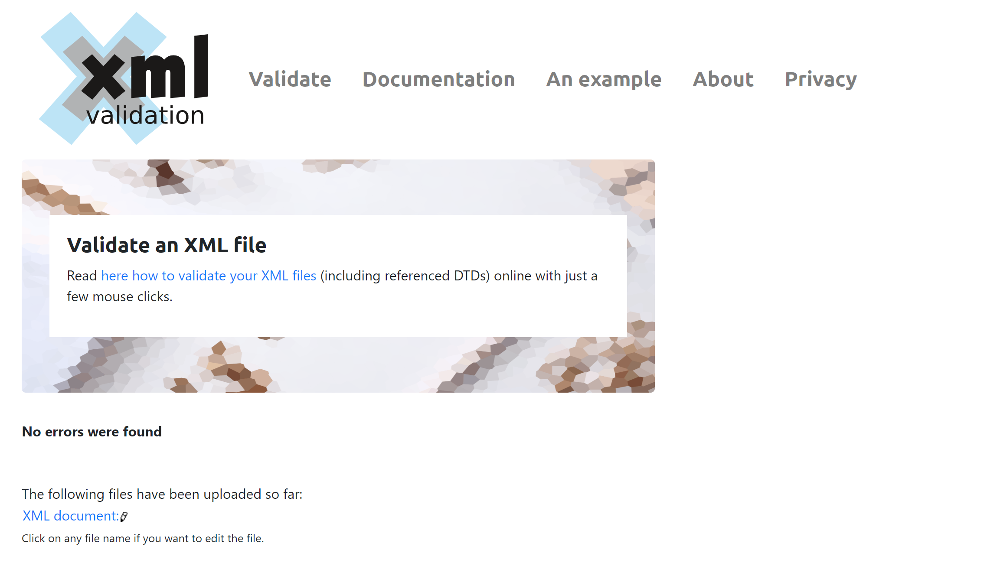
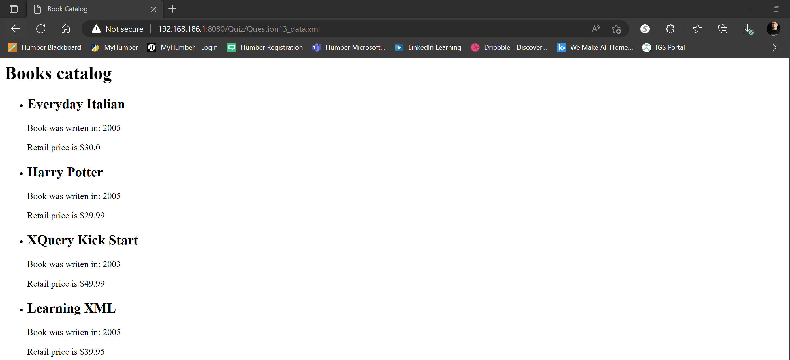
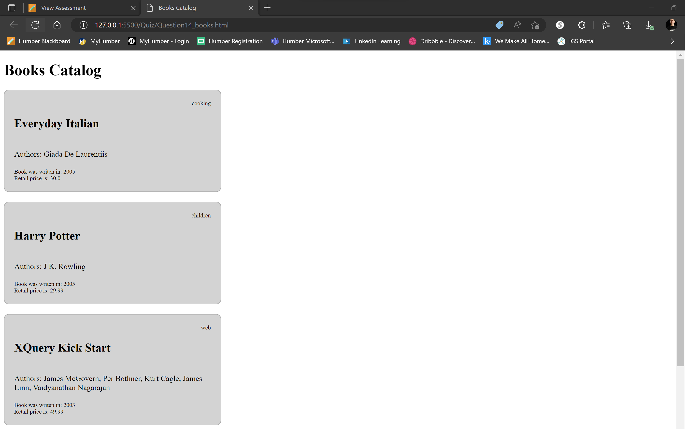

## Quiz1
## Leon Czarlinski - n01541167

## Question 11. Convert the attached json into xml and create dtd for it. Verify that your xml is well-formed and valid Attach your xml, dtd, and validation screenshots
- The XML is validated with the https://www.xmlvalidation.com/. I also did an internal DTD, which is inside of the file
- 
- [href](../Quiz/Question11_data.xml)

## Question 12. Create xsd for xml file your created for question 11 Verify that your xsd is valid Attach your xml, xsd, and validation screenshots
- 
- [href](../Quiz/Question12_data.xml)
- [href](../Quiz/Question12_data.xsd)

## Question 13. Using xml you created for question 11 create xslt file that replicates this layout
- 
- 
- 

## Question14. Create html file and using xml file you created for question 11 replicate the following layout
- 
- 
- 
- 

