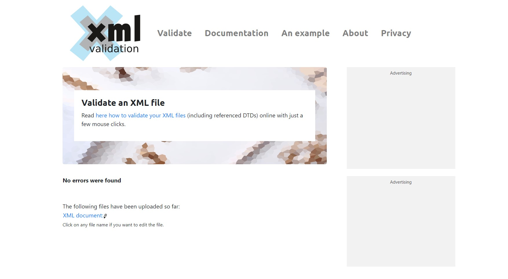
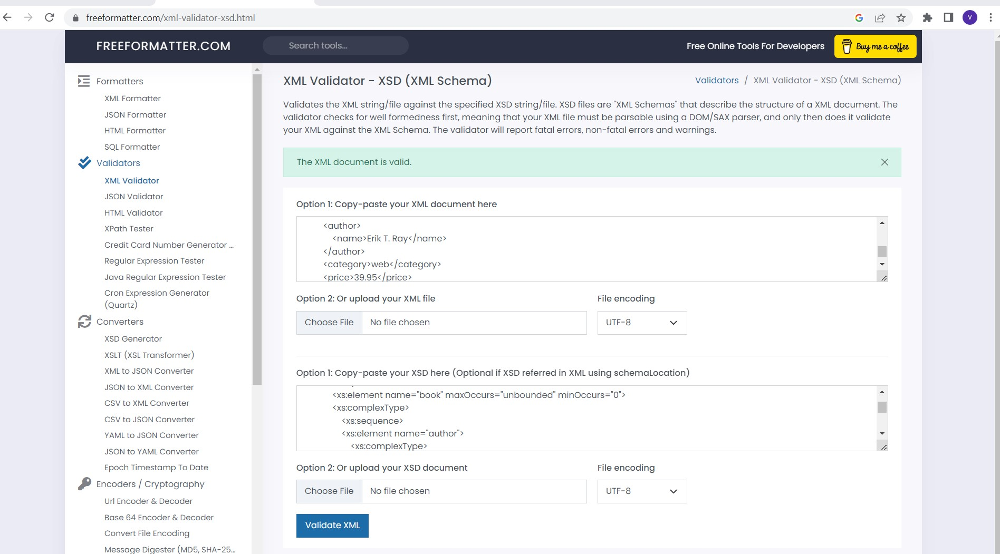

<!-- Vimal Radadiya -->
Question_11
Ans:xml and dtd is done in data.xml file. Screenshot is attached below.

Question_12
Ans: done in data.xsd and validate through online validator. Screenshot is attached below.

Question_14
Ans: done in data.html Screenshot is attached below.
