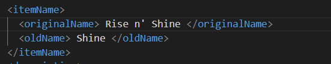
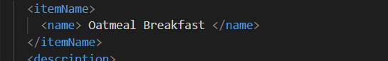
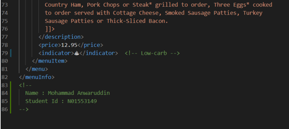
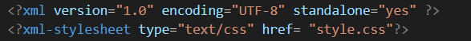
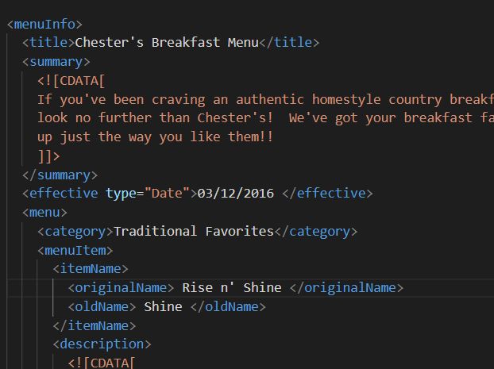
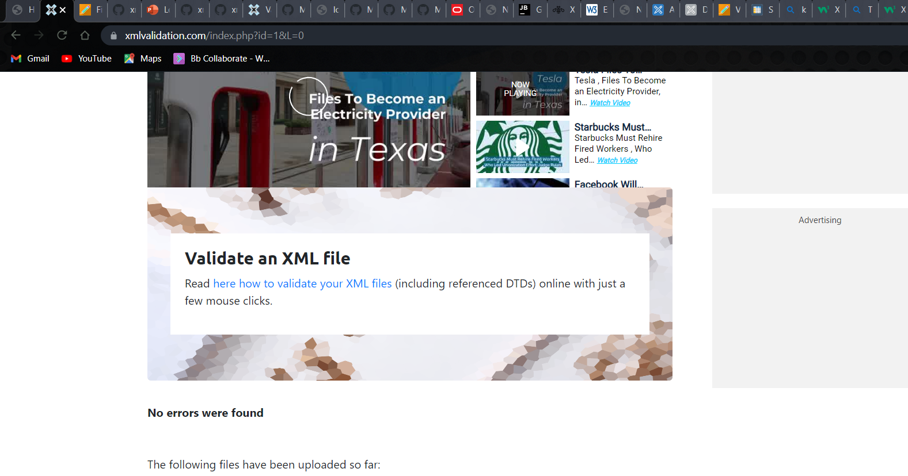
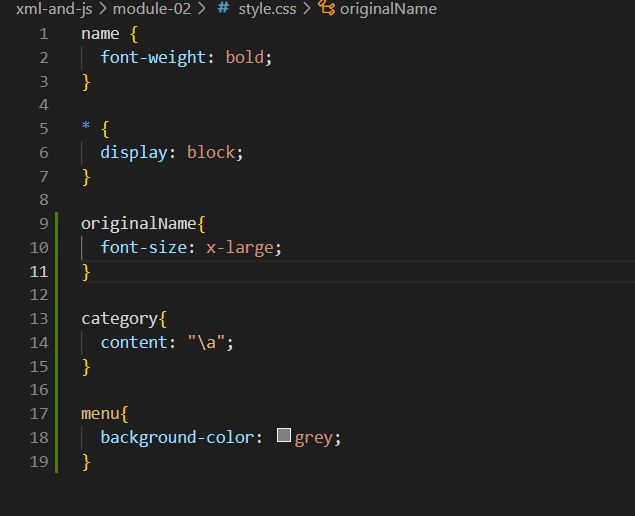

1.Ans

 error 1
The date attribute should be present under the effective element.

	Error : <effective Date> </effective Date>

	Fixed : <effective type=”Date”> </effective>

error 2 
Changes the element name as originalName

Error : <orginalName> <originalname>
Fixed : <orginalName> <originalName>

error 3

Error :<orginalName> <name>
FIXED : <name> <name>

2.Ans

 The CDATA parses the single quote, asterisk, comma, percentage because XML cannot parse it 
so we will use the CADTA to parse it.

3.Ans
<!--
		Name : Mohammad Anwaruddin
		StudentId : N01553149
	-->

4.Ans

prolog : The dcoument just before the document begings 

Document Body: The Document Part from where the root element begins

epilog : The final Comments and processing instructions

Processing Instructions: Yes we have processing Instructions

5.Ans Added DTD in the document

6.Ans : Validated and there are no errors found

7.Ans : Created .css File and linked it to the file 

