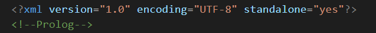
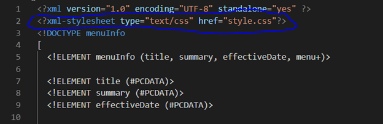

# Assignment 1
1.	Open module-2/assignments/assignment.xml in your browser. Are there any errors?
Explain the error and fix it.

**For the first error message when opening the xml file in Google Chrome, this is being displayed:**

**The error points out line 11 of the xml code, where in element <effective Date> were written incorrectly. There is a space between words “effective” and “Date” which causes the error**. 

**To fix this, we should remove the space between the two words. After fixing the first error and opening the xml file in Google Chrome, this second error is being displayed:**

**It says that there is something wrong with the code in line 31, which is the opening and ending tag not being the same. The opening tag for “originalName” is spelled as is, but the closing tag is misspelled as “orginalname” (lowercase n). To correct this, we make the closing tag to </originalName> to match the opening tag <originalName>.**

**After fixing the second error and opening the xml file in Google Chrome, this third error is being displayed:**

2.	What is the use of CDATA block in this document?

**The CDATA block was used for the summary element (summary of the whole menu) and description element (description for each item in a specific menu), housing all words in one paragraph within the CDATA blocks’ opening <![CDATA[ and closing ]]> tags, then displaying it in Google Chrome as the whole content of each element. In Google Chrome, the whole CDATA block shows its element’s text contents in one line, regardless if the sentences are broken during the process of writing the xml code by pressing the Enter key.**

3.	Add comment line to the end of file which contains you name and student id.

4.	Identify prolog, document body, and epilog in the document. Are there any processing instructions?

**The whole xml prolog contains an XML Declaration, Processing Instructions, Comment Lines and Document Type Declaration (DTD). However, in this document, only XML Declaration is available, which is in line 1 of the code:**

**So this is the only part in the document that represents the prolog.**

**The document body contains the content of the document, showing the hierarchical structure of elements. In this document, this part is the document body (everything between the root element menuInfo):**

**An epilog is the final comments or processing instructions found at the last part of the document. In this case, it is line 82 which is my name and student id.**

5.	Add inline DTD for this document.

<!DOCTYPE menuInfo
[ 
  <!ELEMENT menuInfo (title, summary, effectiveDate, menu+)>

  <!ELEMENT title (#PCDATA)>
  <!ELEMENT summary (#PCDATA)>
  <!ELEMENT effectiveDate (#PCDATA)>

  <!ELEMENT menu (category, menuItem+)>

  <!ELEMENT category (#PCDATA)>

  <!ELEMENT menuItem (itemName+, description, price, indicator*)>

  <!ELEMENT itemName (originalName, oldName?)>
  
  <!ELEMENT originalName (#PCDATA)>
  <!ELEMENT oldName (#PCDATA)>

  <!ELEMENT description (#PCDATA)>
  <!ELEMENT price (#PCDATA)>
  <!ELEMENT indicator (#PCDATA)>
]>

6.	Verify that file is well-formed and valid.

**Using validation sites to validate my xml code, I confirmed that my xml file is both valid well-formed as the DTD was applied correctly for each element (valid), the structure/hierarchy of elements are well organized, and there are no syntax errors (well-formed):**

7.	Create style.css file and link it to the file. 

Add the following styles to the .css:

•	Change font-size of originalName
•	Display each category on the new line
•	Add any other css-rule

Create module-2/assignments/assignment_YOURNAME.md and add your theory answers. Add screenshots of each step to the file (Refer module-1/assignments/evaluation-1.md on how to add image to md file)

