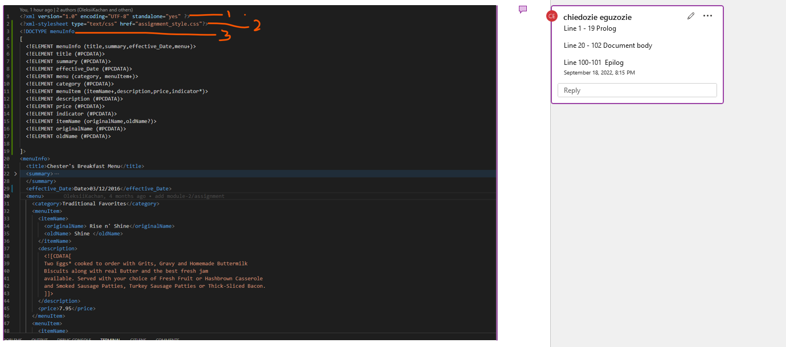

# Assignment 1

Question 1: Attribute name "Date" associated with an element type "effective" must be followed by the ' = ' character. underscore needs to be used between effective and date then an end tag for effective_date
The element type "originalName" must be terminated by the matching end-tag "</originalName>" (thus end element </originalName> inputed.
The element type "name" must be terminated by the matching end-tag "</name>". thus </name > element inputed

Question 2: The use of CDATA in the document is for description and clarity of the subject context
Question 4. Line 1-19 is the prolog, document body is between line 20 and line 102. processing instructions is on line 2
