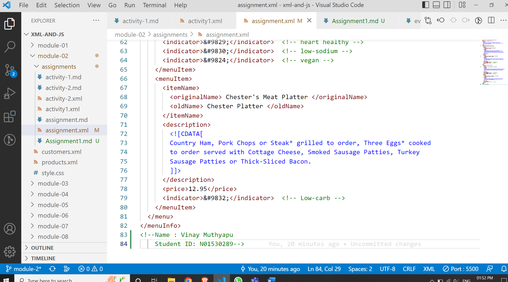
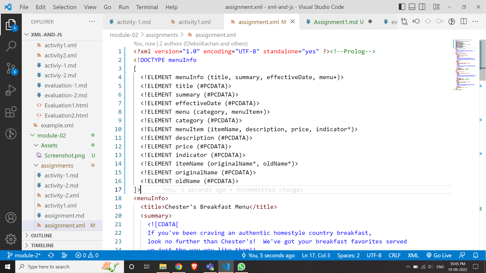
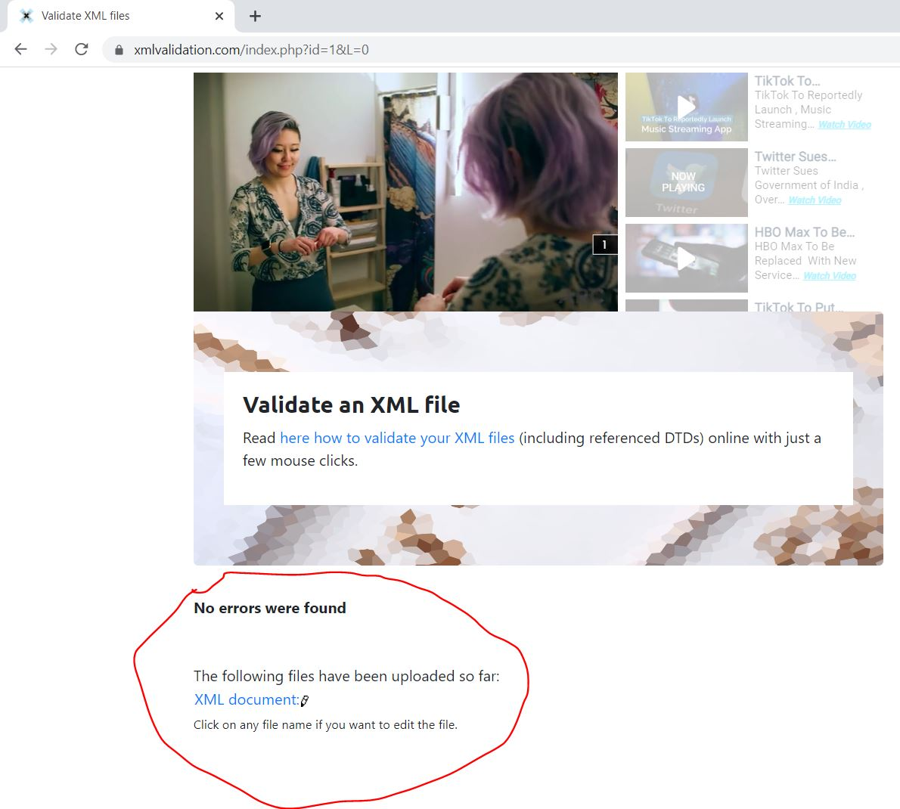
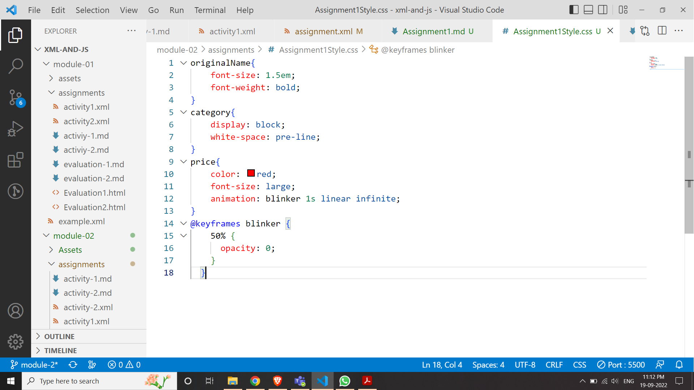
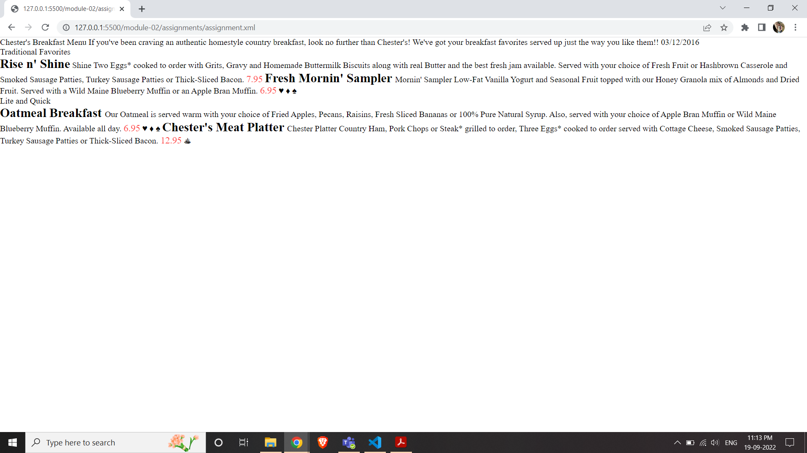

Name: Vinay Muthyapu
Id: N01530289

Assignment1:

1.	Open module-2/assignments/assignment.xml in your browser. Are there any errors? Explain the error and fix it.
Errors:

Error1: 
<effective Date>:
The tag does not follow the rules : The above XML tag can be written as follows
<effectiveDate></effectiveDate>
Or
<effective type=”Date”></effective>

Error2:
<originalName> Fresh Mornin' Sampler </originalname>:
Opening and closing tags mismatch the above can be written as 
        <originalName> Fresh Mornin' Sampler </originalName>

Error3:
<name> Oatmeal Breakfast </originalName>
Opening and closing tags not matching.

2.What is the use of CDATA block in this document?

CDATA block here is used to provide description for each menu item. The description has special characters in it here CDATA is used to skip the special characters and display / allow to use the content as it is.

3.Add comment line to the end of file which contains you name and student id.
 

4. Identify prolog, document body, and epilog in the document. Are there any processing instructions?

Prolog:
Prolog is the XML declaration which is written at the begining of XML document
assignment.xml file has XML declaration statement init.
ex: <?xml version="1.0" encoding="UTF-8" standalone="yes" ?>

Document body: 
Document body is the part of xml document where data which can be processed is placed under different named user specified tags
Here in assignment.xml file has menu info and details in the document body.

Epilog:
Epilogs are single charector tags or the processeing instruction tags ex: <a>x</a> or <?process?>
Here in assignment.xml there are no epilogs

5. Add inline DTD for this document.

Added DTD to assignment.xml

6. Verify that file is well-formed and valid.

Validated the assignment.xml file using xmlvalidation.com and no errors found DTD includes all the xml components hence it is well formed and there are no syntax errors hence it is valid.

7. Create style.css file and link it to the file. Add the following styles to the .css:
• Change font-size of original Name
• Display each category on the new line
• Add any other css - rule

Added CSS

output

Create module-2/assignments/assignment_YOURNAME.md and add your theory answers. Add screenshots of each step to the file (Refer module-1/assignments/evaluation-1.md on how to add image to md file).
