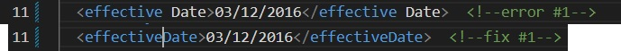
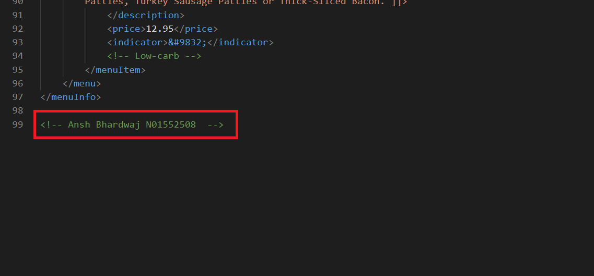
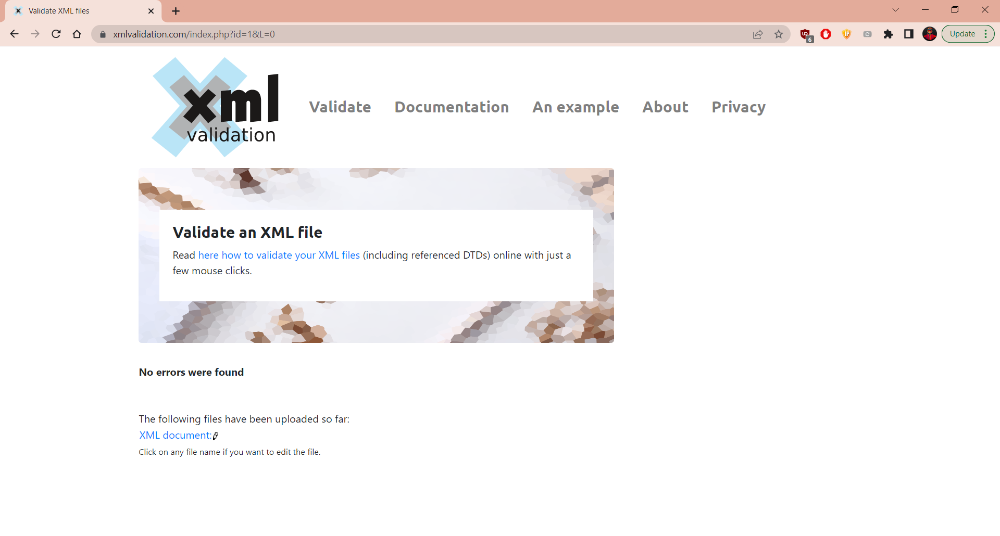
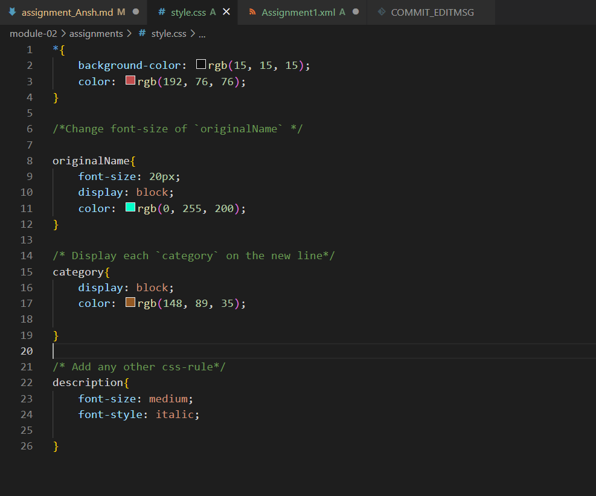

Answer1 - Errors in assignment.xml are as follows:
Error#1 - line 11: Tag name is incorrect since there should be no spaces in tag names.
                    We can fix it by removing the space.
                     
Error#2 - line 31: Opening tag and closing tags are not same.
                    We can fix it by giving them same name for closing tag.
                    
Error#2 - line 51:  opening tag and closing tags are not same.
                    We can fix it by giving them same name for opening tag.
                    

Answer2 - CDATA is used in tags to get the special characters in xml without getting it parsed. It allows to enter the data inside the CDATA as a string.

Answer3 - 

Answer4 - 

Answer5 - 

Answer6 - 

Answer7 - 