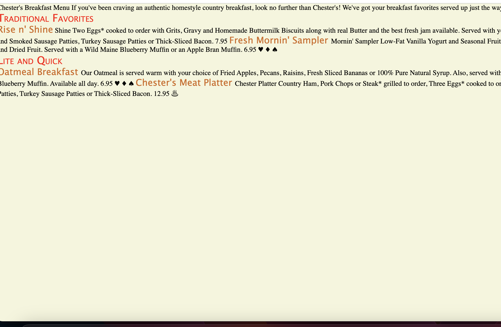
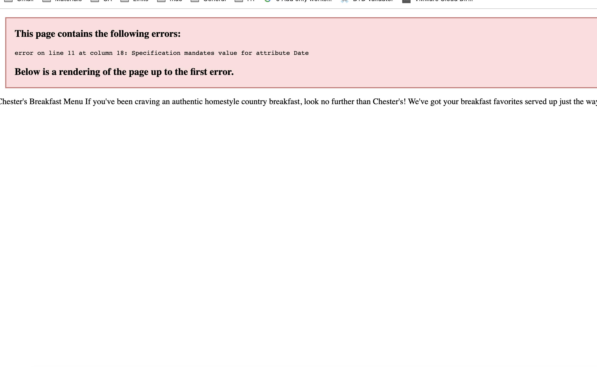
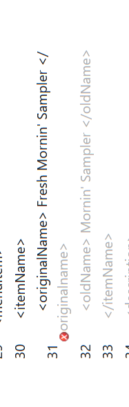
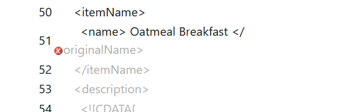

1.
There are 3 errors.
error at line 11 : there waqs space between the xml element effective date.Elements cannot have space.Removed space and replaced as effectiveDate.
error at line 31 - opening and ending tag mismatch for originalname and originalName. corrected as OriginalName.
error  at line 51 - opening and ending tag mismatch for originalname and Name. corrected as OriginalName.

2.
There are special characters such as  the ‘ character , the “ character etc. These Special characters,  can be inserted into XML document by using a character reference; the syntax is: &#nnn;Some symbols also can be identified using an entity reference; the syntax is: &entity; Instead of modifying data by using references we can keep the data as it is in CDATA block. By adding the section which contains special characters inside CDATA Block makes those Character data will not be processed by xml parser , but instead is treated as pure data content.

3. 
comment line added in xml
<!--
  Name  :  Rolita Flavia Quadras
  ID : N01553713
-->

4.
Prolog provides information about the document itself 
• XML declaration : <?xml version="1.0" encoding="UTF-8" standalone="yes" ?>
• Processing instructions : <?xml-stylesheet type="text/css" href="style.css"?>
• Comments lines : <!--
  Name  :  Rolita Flavia Quadras
  ID : N01553713
-->
• Document type declaration (DTD) : <!DOCTYPE menuInfo 
[
  <!ELEMENT menuInfo (title,summary,effectiveDate,menu+)>
  <!ELEMENT title (#PCDATA)>
  <!ELEMENT summary (#PCDATA)>
  <!ELEMENT effectiveDate (#PCDATA)>
  <!ELEMENT menu (category,menuItem+)>
  <!ELEMENT category (#PCDATA)>
  <!ELEMENT menuItem (itemName,description,price,indicator*)>
  <!ELEMENT itemName (originalName,oldName*)>
  <!ELEMENT originalName (#PCDATA)>
  <!ELEMENT oldName (#PCDATA)>
  <!ELEMENT description (#PCDATA)>
  <!ELEMENT price (#PCDATA)>
  <!ELEMENT indicator (#PCDATA)>
  
]>
document body: Document body contains the document’s content in a hierarchical tree structure
<menuInfo>
  <title>Chester's Breakfast Menu</title>
  

    <![CDATA[
    If you've been craving an authentic homestyle country breakfast,
    look no further than Chester's!  We've got your breakfast favorites served
    up just the way you like them!!
    ]]>
  

  <effectiveDate>03/12/2016</effectiveDate>
  <menu>
    <category>Traditional Favorites</category>
    <menuItem>
      <itemName>
        <originalName> Rise n' Shine</originalName>
        <oldName> Shine </oldName>
      </itemName>
      <description>
        <![CDATA[
        Two Eggs* cooked to order with Grits, Gravy and Homemade Buttermilk
        Biscuits along with real Butter and the best fresh jam
        available. Served with your choice of Fresh Fruit or Hashbrown Casserole
        and Smoked Sausage Patties, Turkey Sausage Patties or Thick-Sliced Bacon.
        ]]>
      </description>
      <price>7.95</price>
    </menuItem>
    <menuItem>
      <itemName>
        <originalName> Fresh Mornin' Sampler </originalName>
        <oldName> Mornin' Sampler </oldName>
      </itemName>
      <description>
        <![CDATA[
        Low-Fat Vanilla Yogurt and Seasonal Fruit topped with our Honey Granola
        mix of Almonds and Dried Fruit. Served with a Wild Maine Blueberry Muffin
        or an Apple Bran Muffin.
        ]]>
      </description>
      <price>6.95</price>
      <indicator>&#9829;</indicator>  <!-- heart healthy -->
      <indicator>&#9830;</indicator>  <!-- low-sodium -->
      <indicator>&#9824;</indicator>  <!-- vegan -->  
    </menuItem>
  </menu>
  <menu>
    <category>Lite and Quick</category>
    <menuItem>
      <itemName>
        <originalName> Oatmeal Breakfast </originalName>
      </itemName>
      <description>
        <![CDATA[
        Our Oatmeal is served warm with your choice of Fried Apples, Pecans, Raisins,
        Fresh Sliced Bananas or 100% Pure Natural Syrup. Also, served with your
        choice of Apple Bran Muffin or Wild Maine Blueberry Muffin. Available
        all day.
        ]]>
      </description>
      <price>6.95</price>
      <indicator>&#9829;</indicator>  <!-- heart healthy -->
      <indicator>&#9830;</indicator>  <!-- low-sodium -->
      <indicator>&#9824;</indicator>  <!-- vegan -->  
    </menuItem>
    <menuItem>
      <itemName>
        <originalName> Chester's Meat Platter </originalName>
        <oldName> Chester Platter </oldName>
      </itemName>
      <description>
        <![CDATA[
        Country Ham, Pork Chops or Steak* grilled to order, Three Eggs* cooked
        to order served with Cottage Cheese, Smoked Sausage Patties, Turkey
        Sausage Patties or Thick-Sliced Bacon.
        ]]>
      </description>
      <price>12.95</price>
      <indicator>&#9832;</indicator>  <!-- Low-carb -->
    </menuItem>
  </menu>
</menuInfo>
epilog :  Epilog is optional and contains any final comments or processing instructions
<!--
  Name  :  Rolita Flavia Quadras
  ID : N01553713
-->

5.
inline DTD is added.
<!DOCTYPE menuInfo 
[
  <!ELEMENT menuInfo (title,summary,effectiveDate,menu+)>
  <!ELEMENT title (#PCDATA)>
  <!ELEMENT summary (#PCDATA)>
  <!ELEMENT effectiveDate (#PCDATA)>
  <!ELEMENT menu (category,menuItem+)>
  <!ELEMENT category (#PCDATA)>
  <!ELEMENT menuItem (itemName,description,price,indicator*)>
  <!ELEMENT itemName (originalName,oldName*)>
  <!ELEMENT originalName (#PCDATA)>
  <!ELEMENT oldName (#PCDATA)>
  <!ELEMENT description (#PCDATA)>
  <!ELEMENT price (#PCDATA)>
  <!ELEMENT indicator (#PCDATA)>
]>

6.
File verified through DTD validator. No errors and it is well formed.

7. 
css file is created and Changed font-size of `originalName`,Displayed each `category` on the new line

originalName {
    font-size: 1.3em;
    font-family: 'Lucida Sans', 'Lucida Sans Regular', 'Lucida Grande', 'Lucida Sans Unicode', Geneva, Verdana, sans-serif;
    color: chocolate;
}

  category {
    display: block;
    font-size: 1.5em;
    font-style: bold;
    font-family: 'Lucida Sans', 'Lucida Sans Regular', 'Lucida Grande', 'Lucida Sans Unicode', Geneva, Verdana, sans-serif;
    font-variant: small-caps;
    color: red;
    }

    * {
        background-color: beige;
    }

images:

