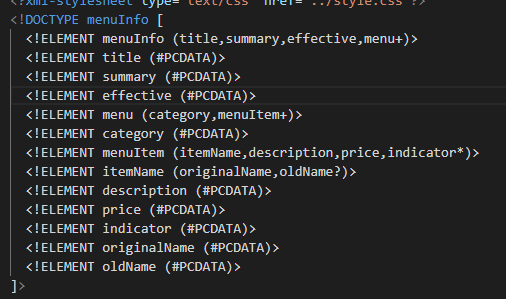
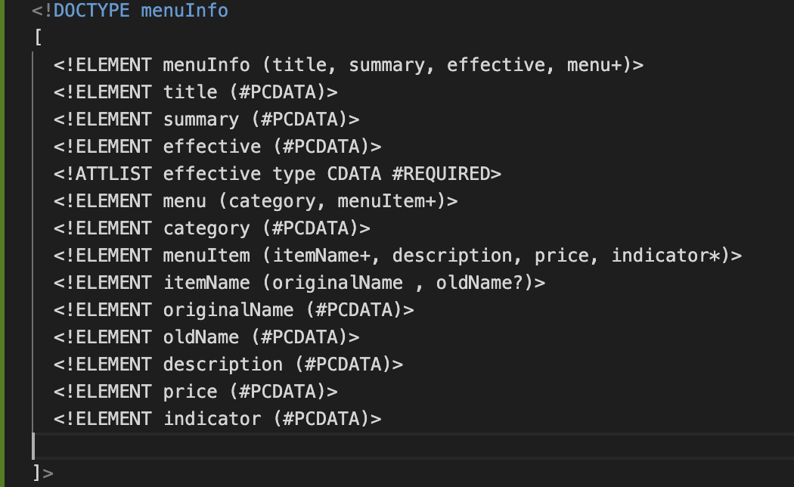
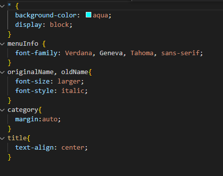

# Assignment 1

1. The date attribute should be present in the effective element. This is the first error
    the document.
    From :
  <effective Date></effective>
    To : 
  <effective type="Date"></effective>
   The second error is originalname. It should be originalName.
   The third error is name. It should be originalName.

   
   

2. CDATA stands for Character Data and it means that the data in between these strings includes data that are not parsed by the parser, but are otherwise recognized as markup.

3. Below comment section is added to the assignment.xml file. 
<!--
  Sibi Saraswathi Mohan
  n01539502
  -->
  

4. Prolog:

Document Body: The entire root element and child is the document body

Epilog: Final comments and processing instuctions is the epilog.

Yes. We do have the processing instructions. Below are the things that I'm specifying.
<?xml version="1.0" encoding="UTF-8" standalone="yes" ?>
<?xml-stylesheet type="text/css" href="style.css"?>

5. Added DTD to the assignment.xml file.
    

6. Validated the file and found no errors in it.
    

7. Added the following styles in the style.css file.
    Changed the font-size of originalName
    Displayed each category on the new line
    Added color to the title
    