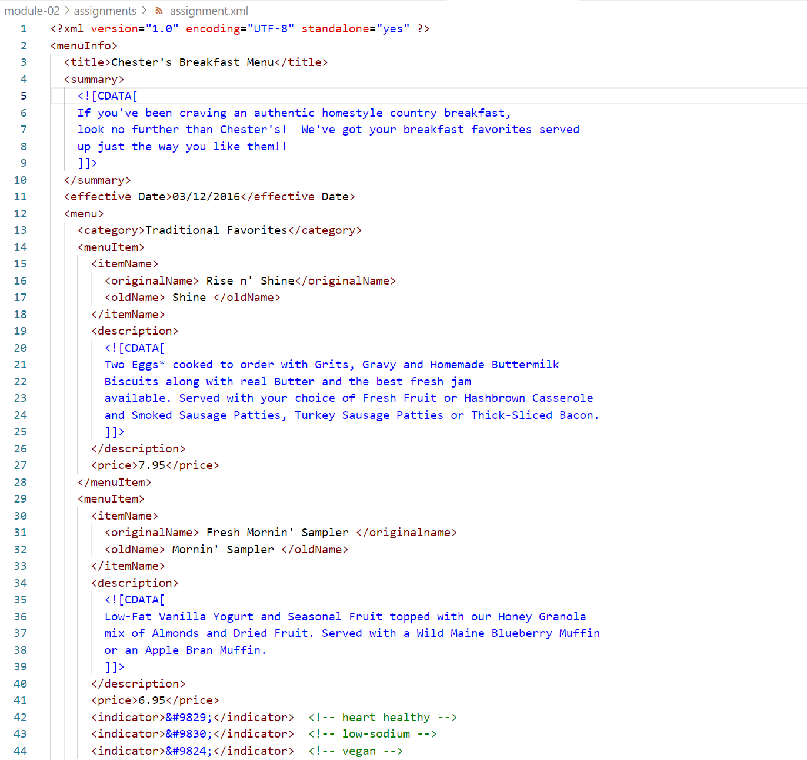
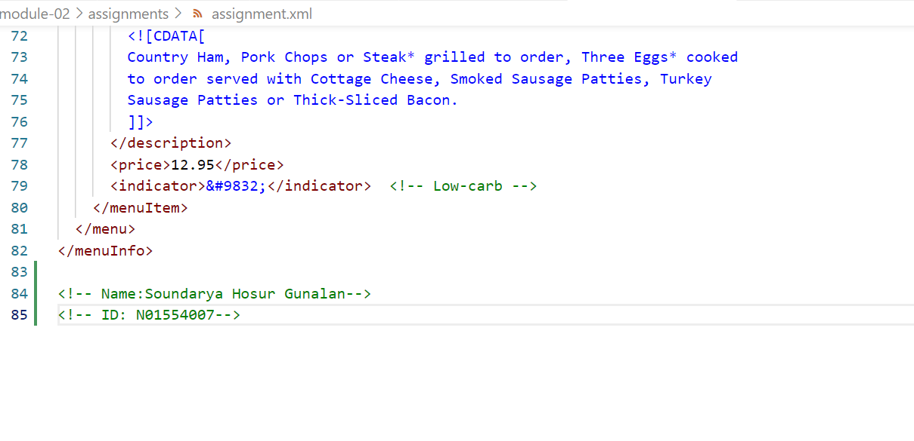
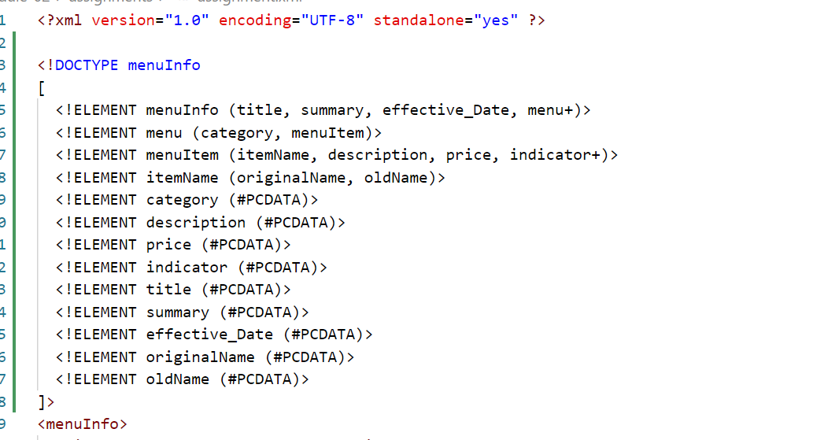
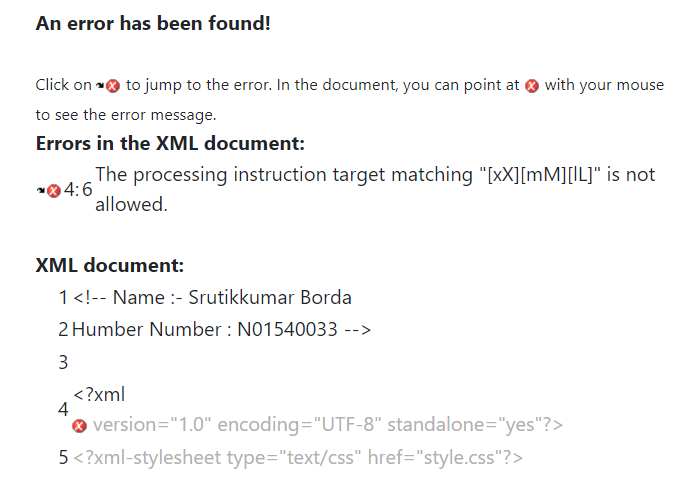
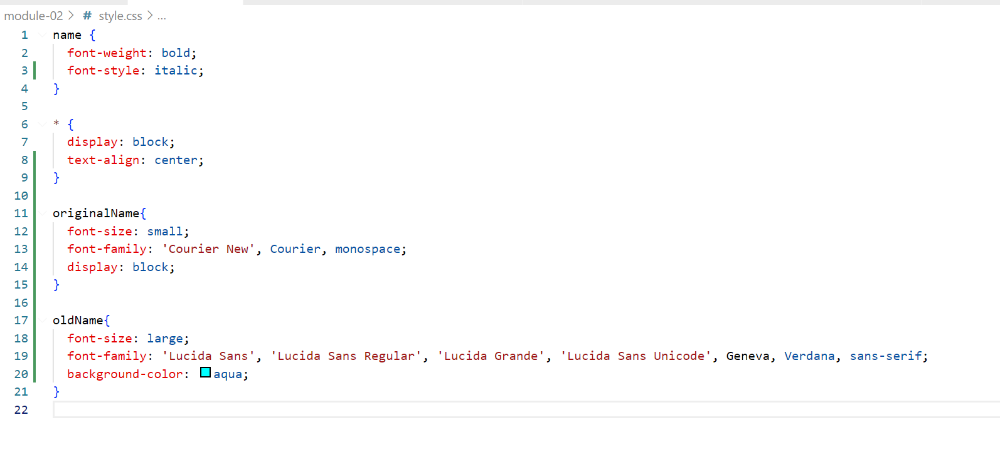

# Assignment 1

1. Open `module-2/assignments/assignment.xml` in your browser. Are there any errors? Explain the error and fix it.

=> The first error I saw in the assignment file is that we can not put the space betweentwo element which can see in the effective data.

=> I am confused but i think we can not give the same name to the element which is given in assignment file called originalName.

2. What is the use of CDATA block in this document?
=> CDATA shows all the information as how to deal with the items which is delivered to the customer or user.

3. Add comment line to the end of file which contains you name and student id.

4. Identify prolog, document body, and epilog in the document. Are there any processing instructions?

5. Add inline DTD for this document.

6. Verify that file is well-formed and valid.

7. Create `style.css` file and link it to the file. Add the following styles to the .css:

- Change font-size of `originalName`
- Display each `category` on the new line
- Add any other css-rule

Create `module-2/assignments/assignment_YOURNAME.md` and add your theory answers. Add screenshots of each step to the file (Refer `module-1/assignments/evaluation-1.md` on how to add image to md file)