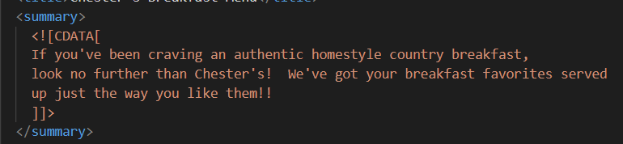
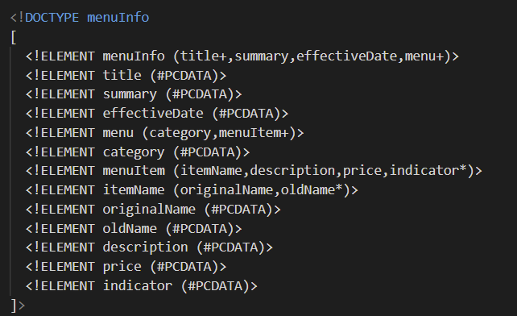
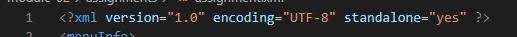
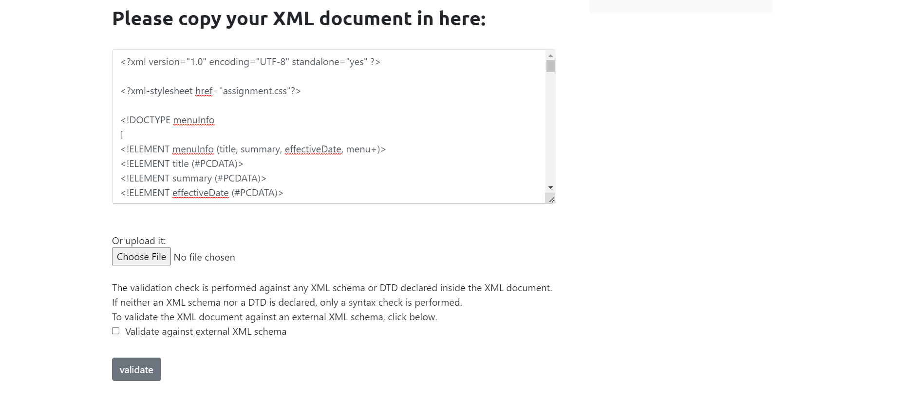
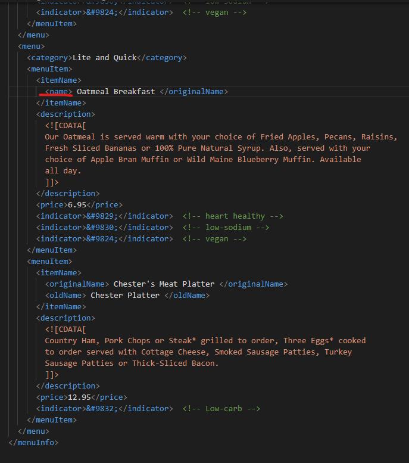
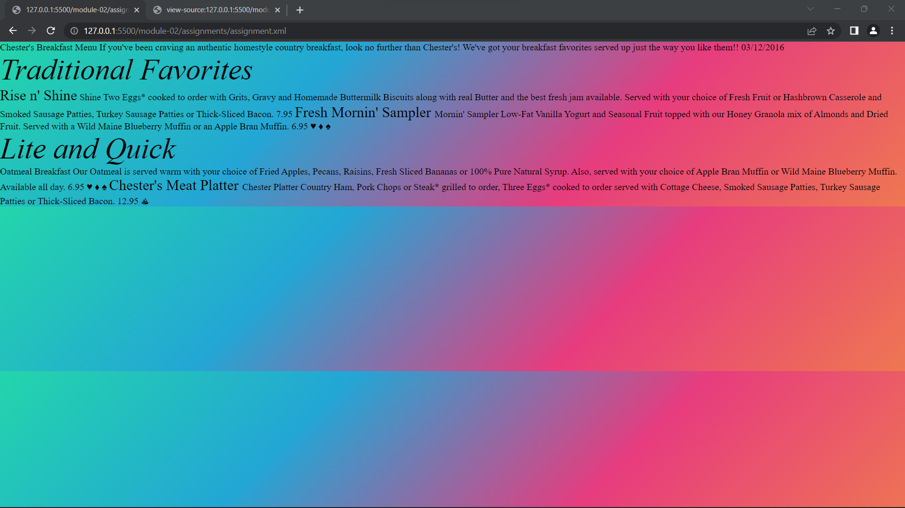

## Answer 1:
    Error at Line 31:
        Here starting tag was something like "<effective Date> and ending tag was like </effective date>"
    Error at Line 51:
        Here, starting tag was "<originalName" and ending tag was "</originalName>
    Error at Line 71:
        Name of the starting tag and closing tag was different i.e., "name" and "originalName" respectively

## Answer 2:
    Whenever we want to include special characters then, we use CDATA.

## Answer 4:
    Prolog: Anything before the starting root tag (in this case, it is menuInfo) is known as Epilog.
    Document body: Structure of xml file
    Epilog: Anything after the closing root tag (in this case, it is /menuInfo) is known as Epilog.

