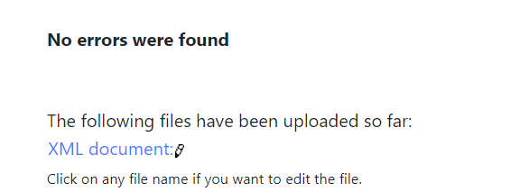
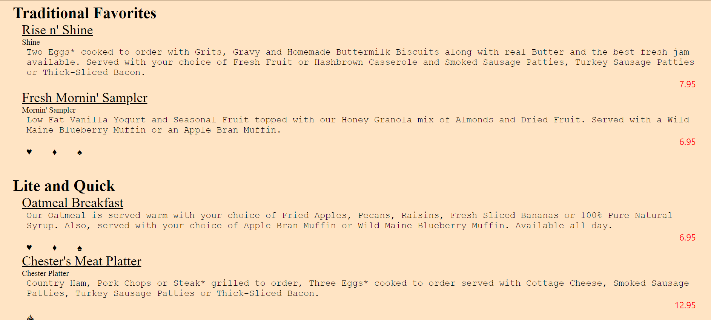
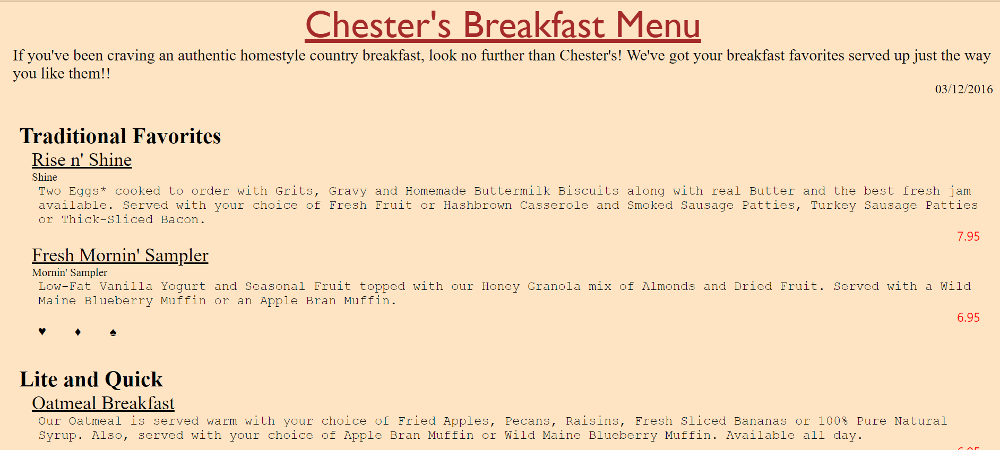

-------------------------------------Name : Vrushali Ponkia(n01530336)--------------------------------------------
-------------------------------------Solution of assignment 1------------------------------------------

Ans 1. Here the first error is of attribute where type="Date" is attribute. So type="Date" is the correct way to show attributes. Thereafter, second and third error is in tags of originalName where opening and closing tag should have same name and also as it is case-sensitive so originalname is not allowed we have to write originalName in closing tag.

Ans 2. Here CDATA block is used in description and summary tag where this interpret as character data and not as markup. Over here *, ', ! and many other is there in the CDATA block.

Ans 3. Comment line added at last.

Ans 4. Here, prolog is XML declaration that is <?xml version="1.0" encoding="UTF-8" standalone="yes" ?>, DTD and processing instruction , document body is anything between <menuinfo> and </menuinfo> tag and epilog is comment mentioned at last which shows name and humber number.

Ans 5. DTD added to the code.

Ans 6. File is well-formed and valid. It is verified proprly. 

Ans 7. css file is added named style1.css.
