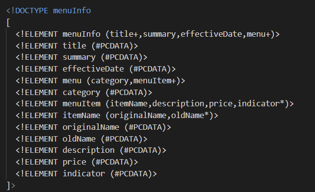

1. At the line 11 the opening element contains the space in the name of the element. Apart from this closing tag is not same as opening tag.
-> AT the line 31, there is difference in the opeing and closing tags.
-> AT the line 51, the name of opeing tag is "name" which should be same as closing tag "originalName".
2. Here CDATA block is used to store the description of the item which containes special characters such as !,', * .
3. 
4. prolog: 
   document body: 
   epilog: 
-> Yes, here css file is included as processing instruction to add style to the given document.
5. 
6. 
7. 
   