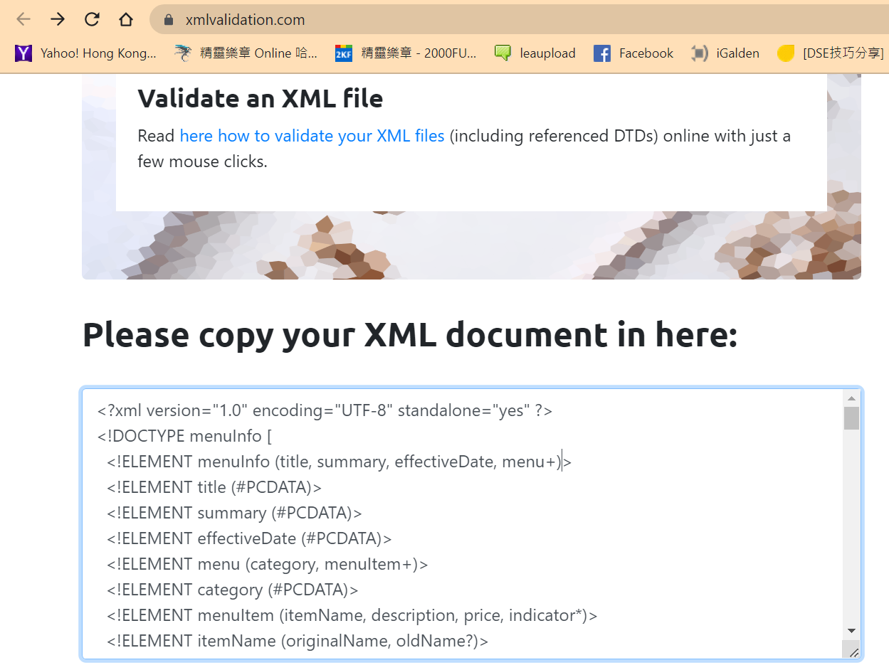

## Answer 2 :

    CDATA block is used to display strings with special characters as it is.

## Answer 4 :

    -> Prolog in this xml file is anything above root element for this file is :-
    <?xml version="1.0" encoding="UTF-8" standalone="yes" ?>.

    -> Document body is the structure of xml file which includes tags and data with it

    -> Epilog is anything below body document or root tag.

