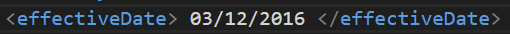
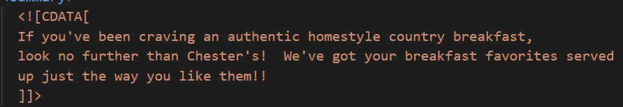
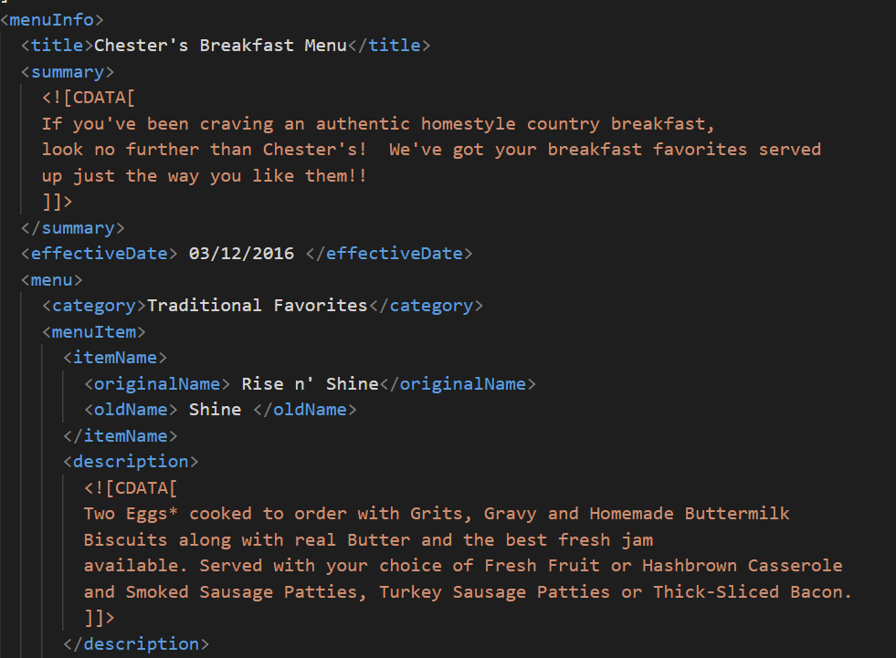
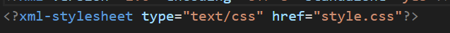
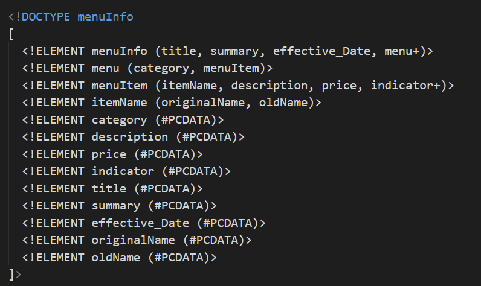
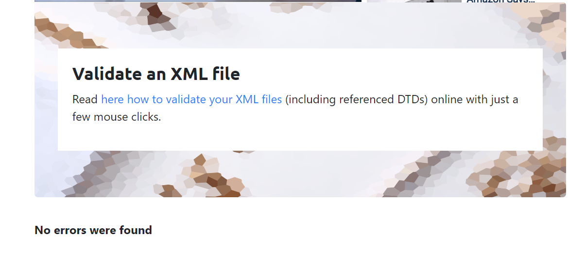
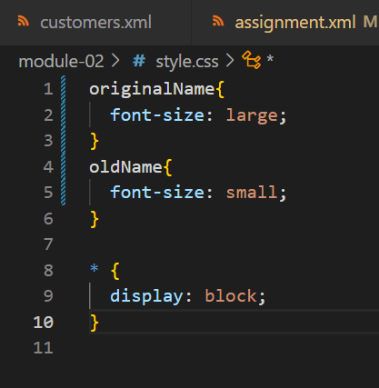

# Assignment 1

1. Open `module-2/assignments/assignment.xml` in your browser. Are there any errors? Explain the error and fix it.
   Ans: We can see error, where we can see that there is a space at the between two element name called effective Date.
   

2. What is the use of CDATA block in this document?
    Ans: There are not same name of the element called originalName as shown below.
    

3. Add comment line to the end of file which contains you name and student id.
    Ans: We can add comment by using the same brackets as in html.
    

4. Identify prolog, document body, and epilog in the document. Are there any processing instructions?
    Ans: Prolog
    
    
    

5. Add inline DTD for this document.
    

6. Verify that file is well-formed and valid.
    

7. Create `style.css` file and link it to the file. Add the following styles to the .css:
    