# Question 1
Open module-2/assignments/assignment.xml in your browser. Are there any errors? Explain theerror and fix it.

There is such error displayed

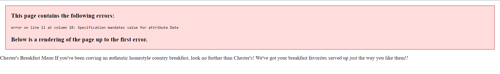

There are several mistakes in code:
1. 
Error

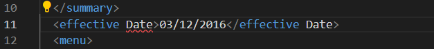

Solution

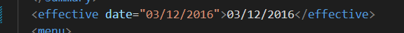

2. 
Error

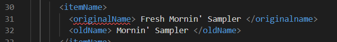

Solution

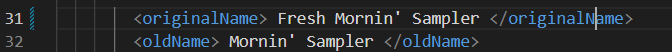

3. 
Error

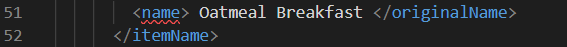

Solution

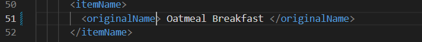

No error no more

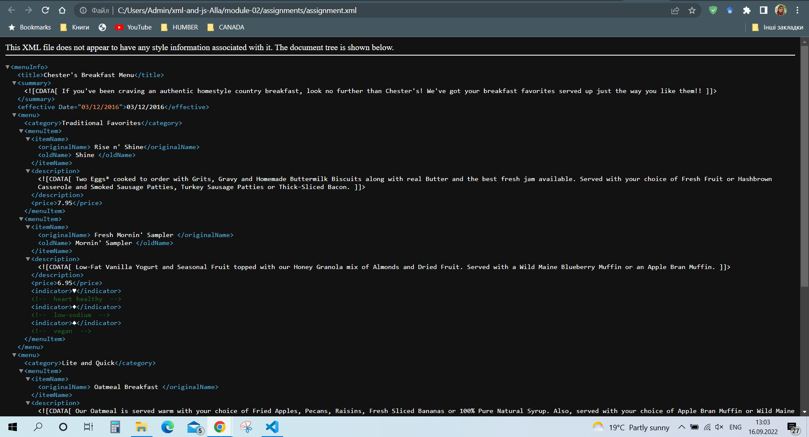

# Question 2
What is the use of CDATA block in this document?

CDATA is used to keep data as it is and XML treats that data just as string / chsracter data but not as special characters.

# Question 3
Add comment line to the end of file which contains your name and student id.

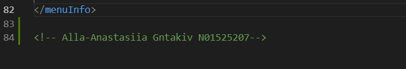

# Question 4
Identify prolog, document body, and epilog in the document. Are there any processing instructions?

Prolog

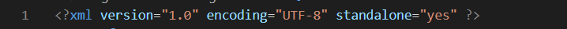

Document body - everything in "menuInfo" including "menuinfo" - root

Epilog

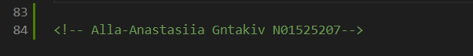

Processing Instructions:
There is no any processing instructions.

# Question 5
Add inline DTD for this document

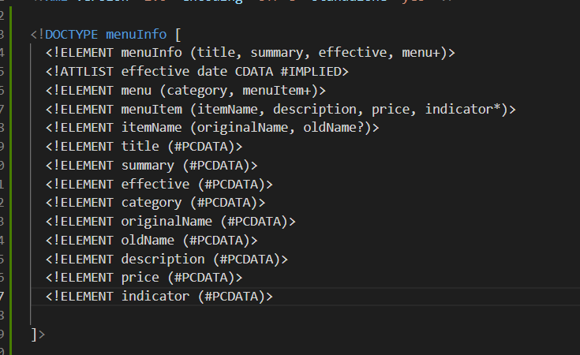

# Question 6
Verify that file is well-formed and valid

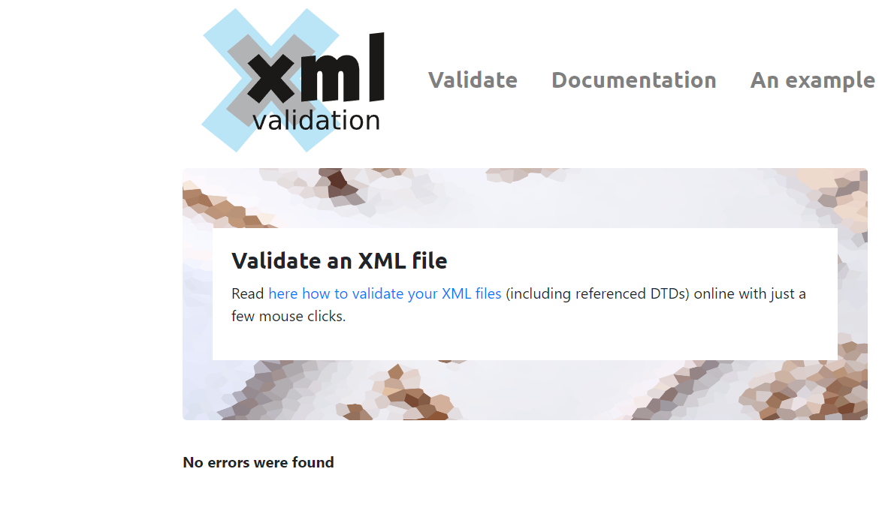

# Question 7
Create style.css file and link it to the file. Add the following styles to the .css:
1. Change font-size of originalName
2. Display each category on the new line
3. Add any other css-rule

link

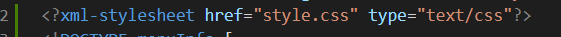

styles

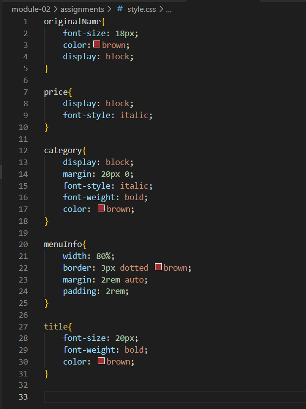

output

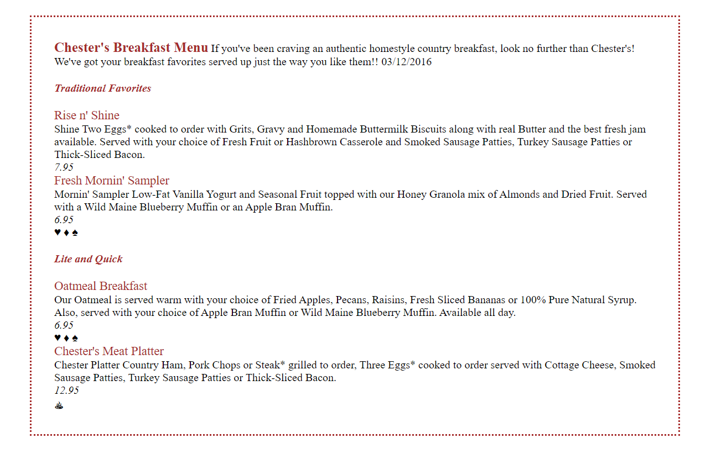