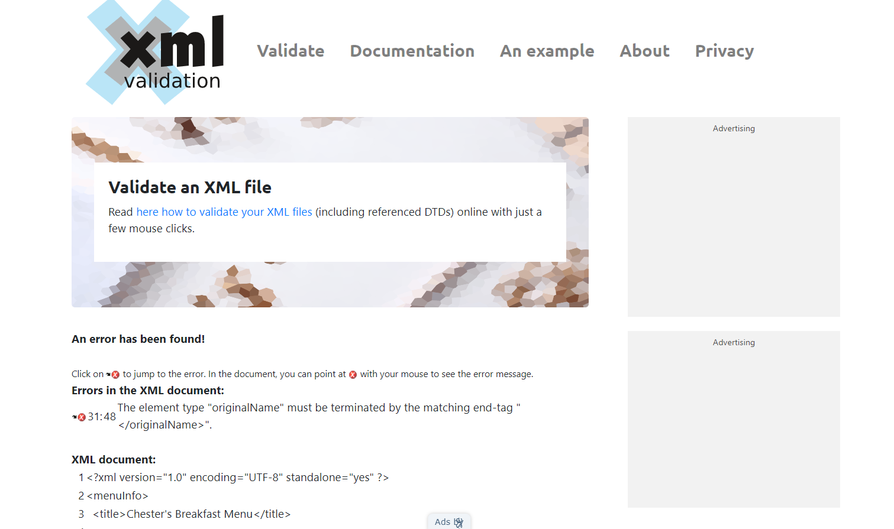
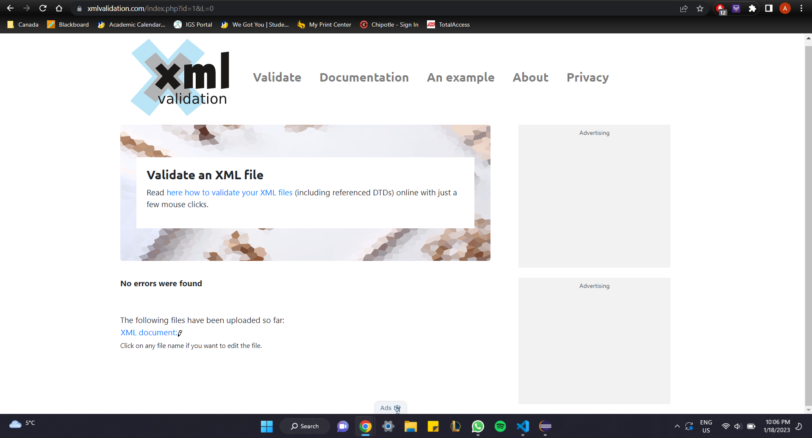

# Assignment 1

1. Open `module-2/assignments/assignment.xml` in your browser. Are there any errors? Explain the error and fix it.
2. What is the use of CDATA block in this document? 
<!-- CDATA allows the user to use characters that could be noted as reserved or embedded characters. This is tell the system to read everything as a String code. The XML parser will only interpret the block of data as character data, not markup data-->
3. Add comment line to the end of file which contains you name and student id.
4. Identify prolog, document body, and epilog in the document. Are there any processing instructions?
<!-- There aren't any processing instructions. I need to create the DTD document AND the xml stylesheet (for CSS) for the XML parser to know what elements I am using -->
5. Add inline DTD for this document.
6. Verify that file is well-formed and valid.
7. Create `style.css` file and link it to the file. Add the following styles to the .css:

- Change font-size of `originalName`
- Display each `category` on the new line
- Add any other css-rule

Create `module-2/assignments/assignment_YOURNAME.md` and add your theory answers. Add screenshots of each step to the file (Refer `module-1/assignments/evaluation-1.md` on how to add image to md file)

<!-- Amos Chew - N01533575 >