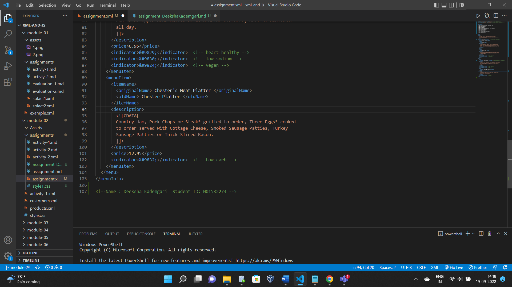
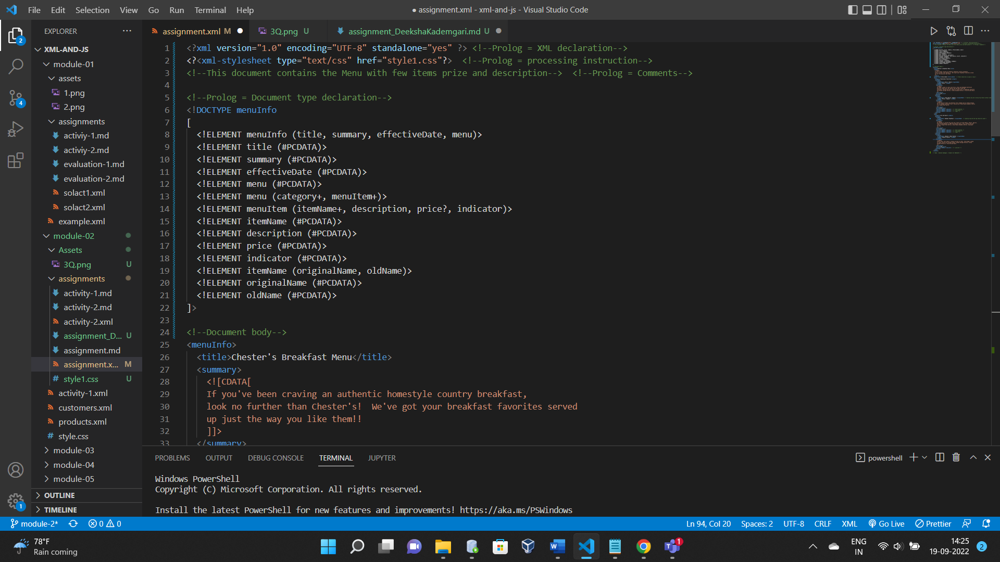
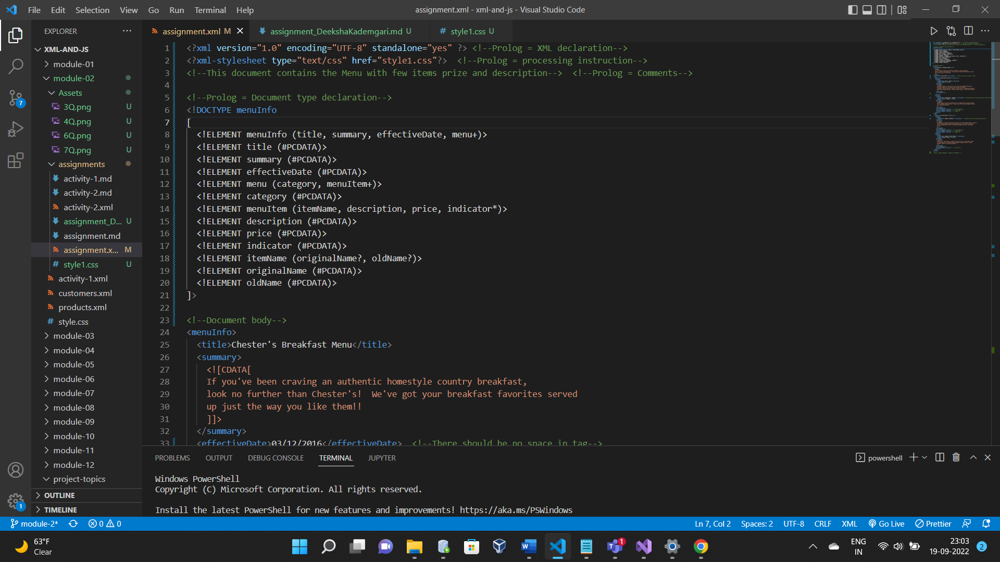
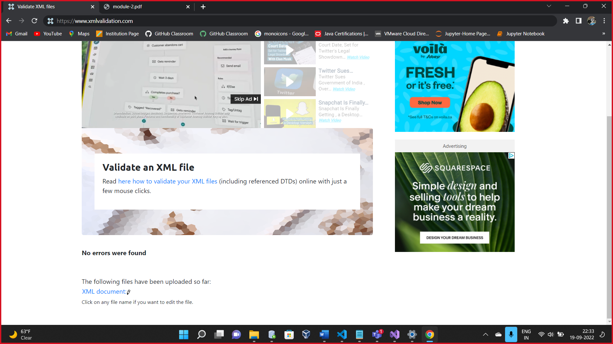
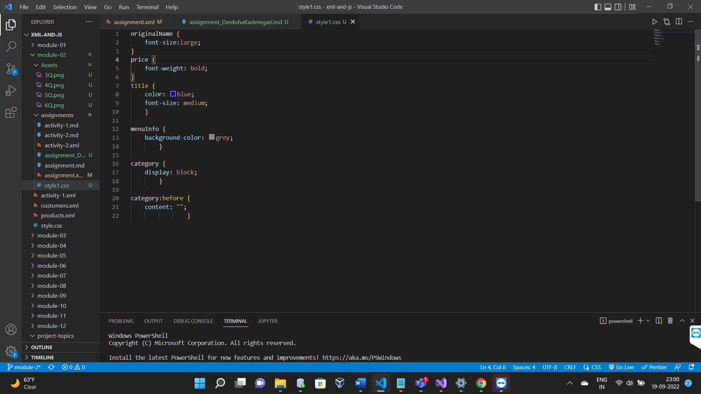

1.  <effectiveDate>03/12/2016</effectiveDate> <!--There should be no space in tag-->
    <originalName> Fresh Mornin' Sampler </originalName> <!--opening tag and closing tag should contain same name-->
    <originalName> Oatmeal Breakfast </originalName> <!--opening tag and end tag should be same-->

2.  The data written in CDATA (character data) is treated as the character data what ever the special characters, everything is treated as a normal text. Data is not interpreted as xml.
    xml has special meaning for < > & these characters are treated as a normal text.

3.  Added comments to the end of file
    

4.  assignment.xml does not contain epilog. It is optional contains comments, processing instructions.

    

    <!--XML document contain
    prolog
        XML declaration
        Processing instructions
        Comments
        DTD
    Document body
    epilog(optional)
        final comments/ instructions -->

5.  Inline DTD
    

6.  the file assignment.xml is well-formed and valid through https://www.xmlvalidation.com/
    

7.  

    Included <?xml-stylesheet type="text/css" href="style1.css"?> in XML to link the CSS doc
