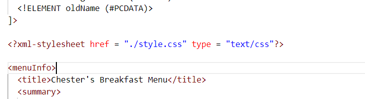
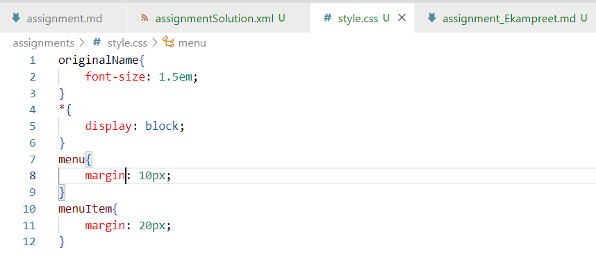

# 1. 
There were only two types of errors in the file:
1. The opening and closing tags were not the same and we had to match that across the document. For example: removing a space between the two words effective and Date to make it a valid tag
2. Replacing the ' symbol with the &apos; so that it can be a well formed xml

# 2.   
CDATA block helps to create the problematic characters into strings, so that xml does not show any undesired result while comphrehending those characters. For example, line break and apostrophe are the characters that xml would not have comprehended correctly and thus we needed to use CDATA or their character or entity references. 

# 3.

# 4.
The prolog is the content which is written above the <menuInfo> tag, which is the root element of this document. In this document, only the XML Declaration is given in the prolog.
The document body is everything that is inside the root tag, i.e., the <menuInfo> tag.
The epilog is the content after the closing root tag, i.e., the </menuInfo> tag. It is just the comment that we had created in the 3rd question.

There are no processing instructions as apart from the XML Declaration and the comment, everything else is the document body.

# 5. 

# 6.

# 7.   

