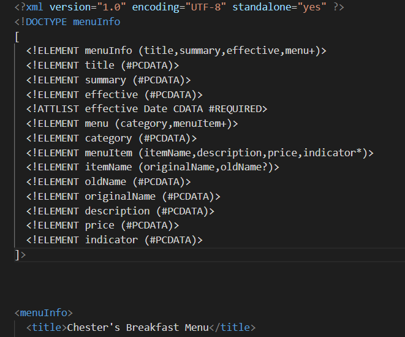

# Assignment 1
# Garima Wadhwa
# n01552997

1. Errors:

2. use of CDATA block in this document:
The data contains markup characters such as: ',*,! .This data inside CDATA will not be processed by the parser but will be treated as data content.

3. 

4. 

 

5. 

6. 

7. 
