Sol 1) 
    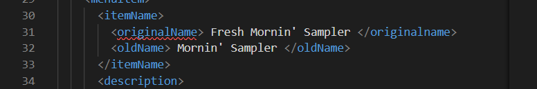
    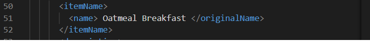
There was an error in the effective tag i.e. <effective Date> is not the valid tag. Either it can be <effective>..</effective> or <effective><date>..</date></effective>. Also, it can have attribute like <effective type = "Date">03122016</effective> and as date can be stored in numerical form special characters needed to be removed.

Also at line 31 and 51, The starting and closing tags should be same like shown below
<originalName>.....</originalName>

Sol 2) The CDATA block in the given XML document is just treated as the pure character without being parsed by the XML.

Sol 3) 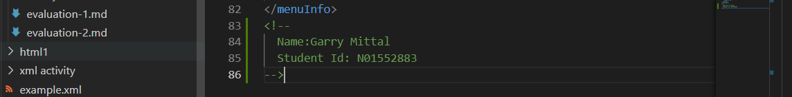
    <!--AnyComment--> tag is used to write comment.

    

Sol 4) Prolog
 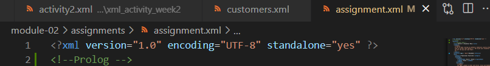
Prolog is anything that is before the root element
Here,<?xml version="1.0" encoding="UTF-8" standalone="yes" ?> is the Prolog.

Document Body
 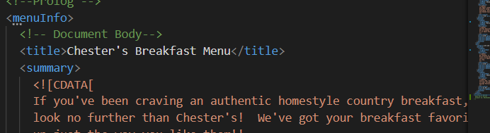
Document body is everything inside the root element.
Here everything inside <menuInfo> is the document body

Epilog
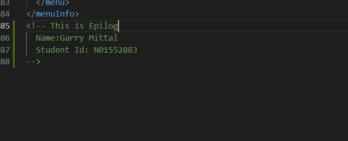
Anything after or outside the root element or root tag is called Epilog.
In the document assignment.xml,
<!-- This is Epilog 
 Name: Garry Mittal
 Student Id: N01552883
--> is the epilog.

No, there is no processing instruction in the given document but there will be in the next few questions when css file will be needed to be mentioned to processed in this XML document.

Sol 5) 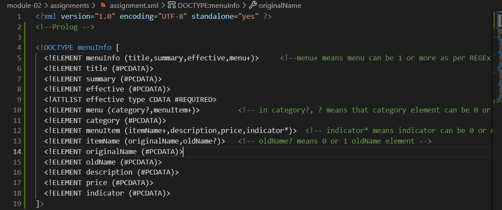

Sol 6) 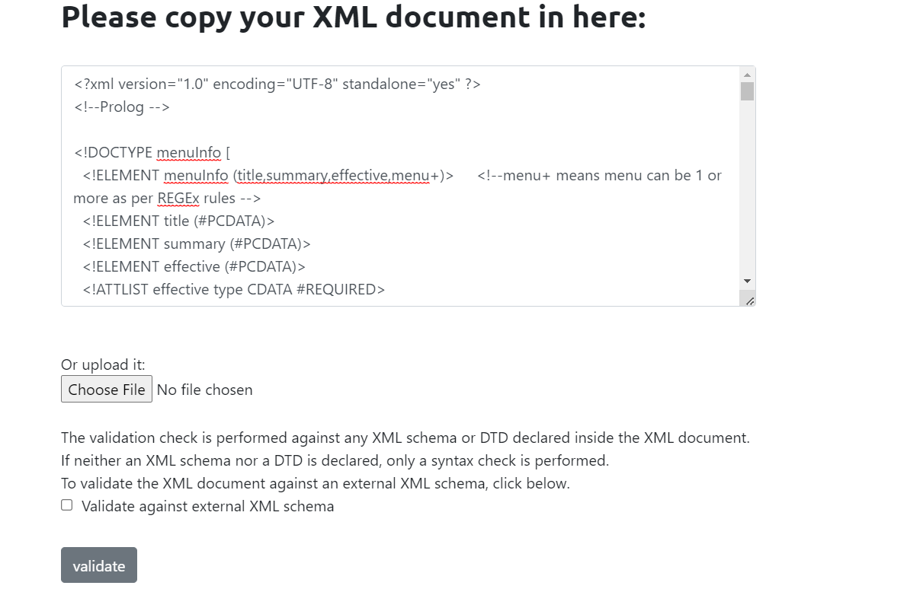
       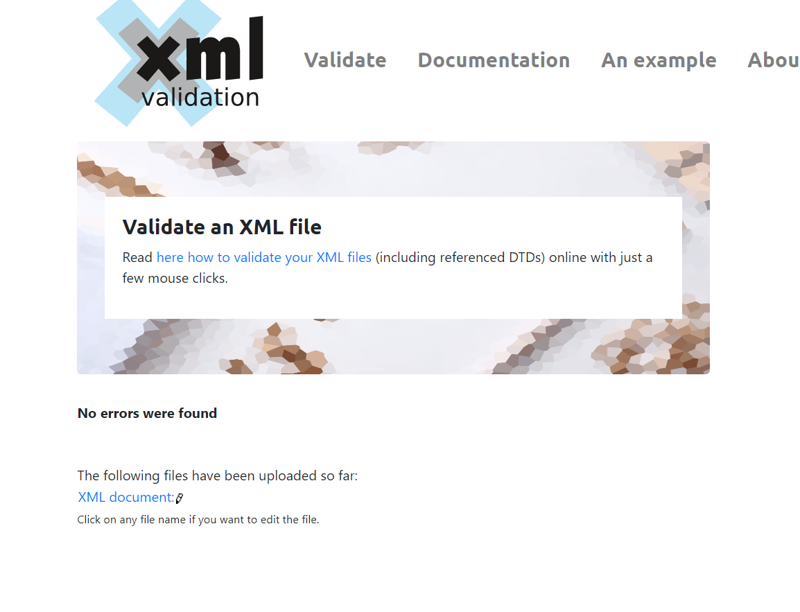

Sol 7) 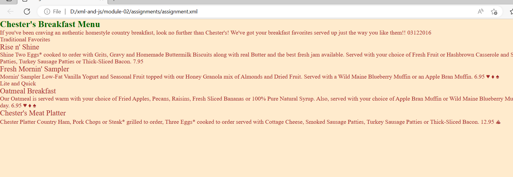
       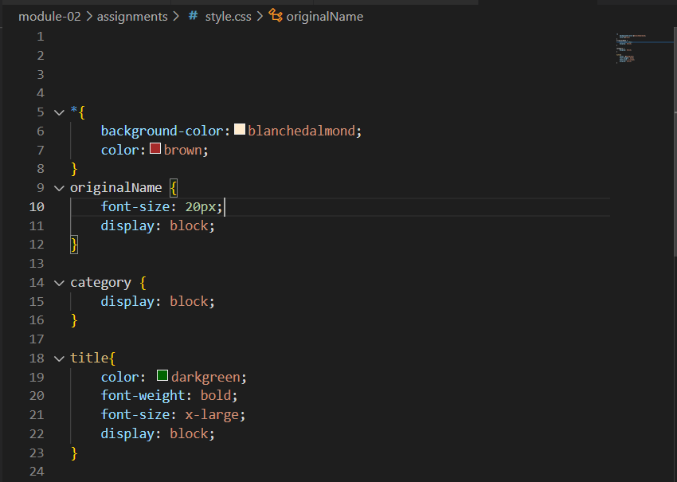

