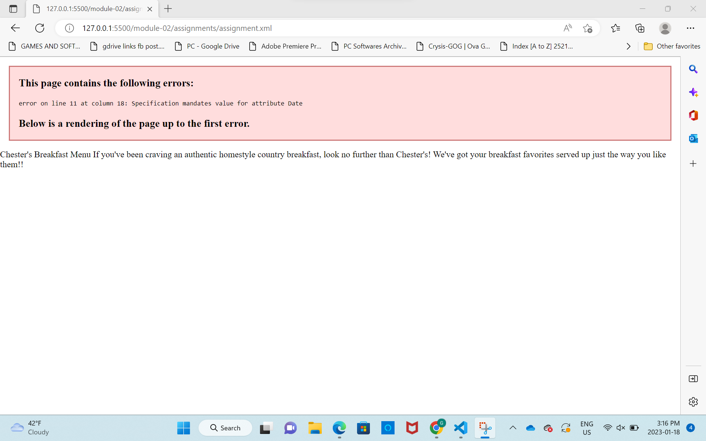
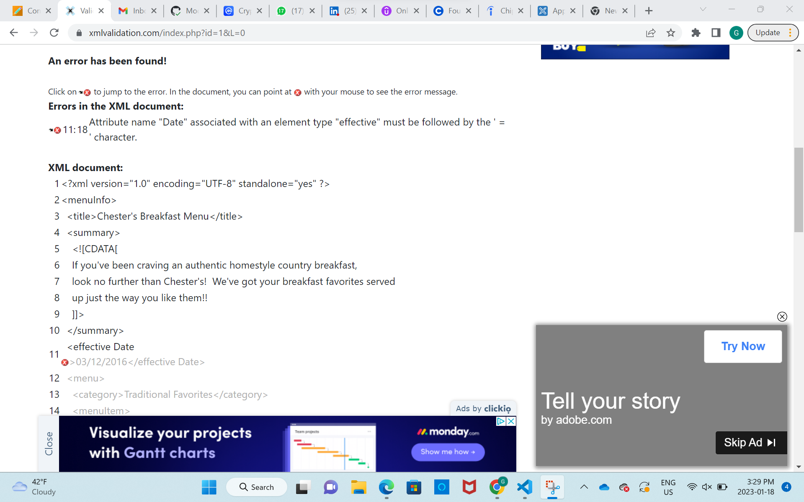
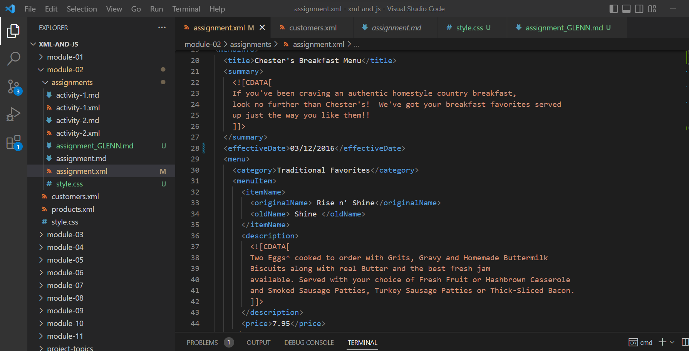
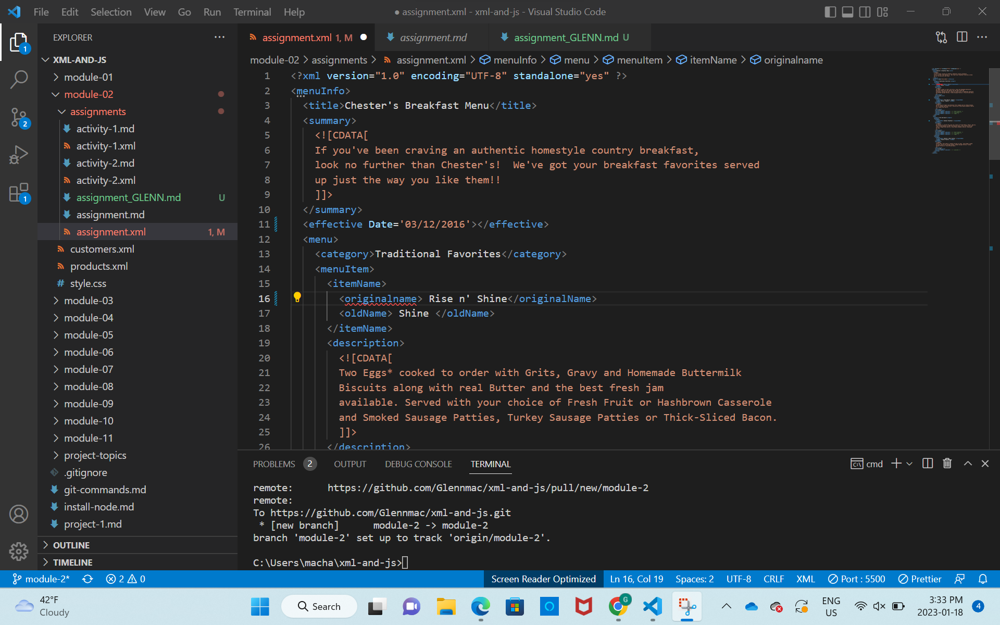
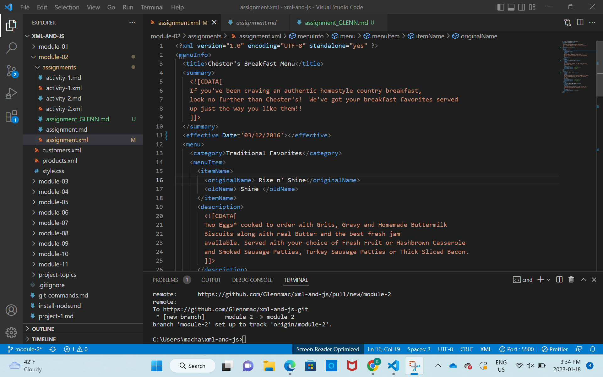
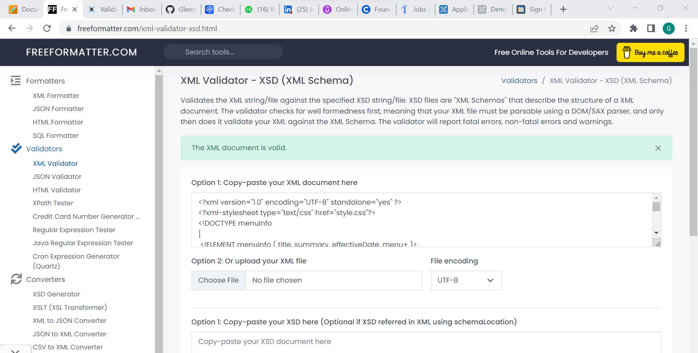
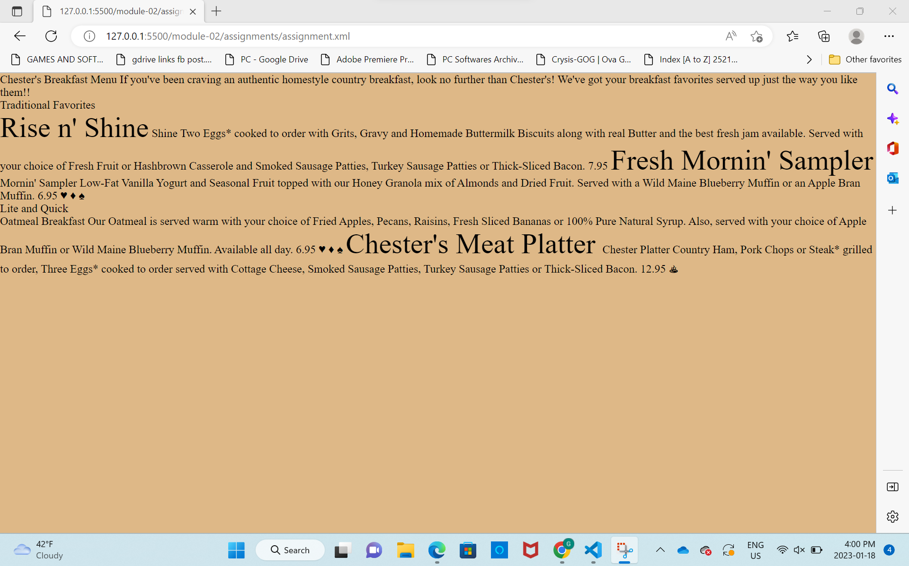
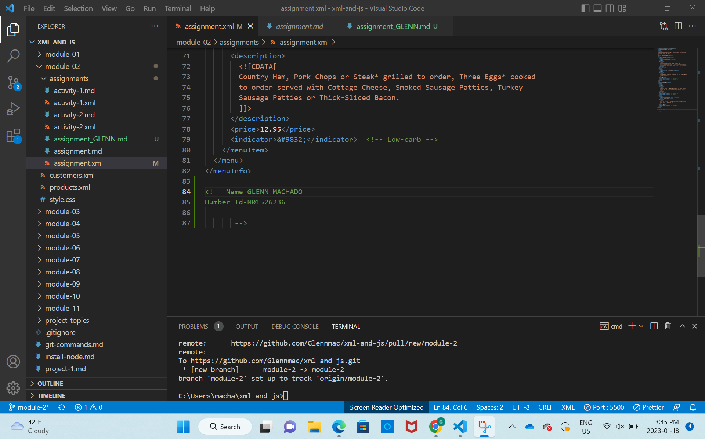

1.
2.CDATA stands for Character data it means that a particular section in XML should not be markup but consider it has a character data.
3.
4.Prolog means the XML declaration of the code.The document body of the code consist of single root element.Epilog basically means the end-tag.There are NO processing instructions.
5.
6.

