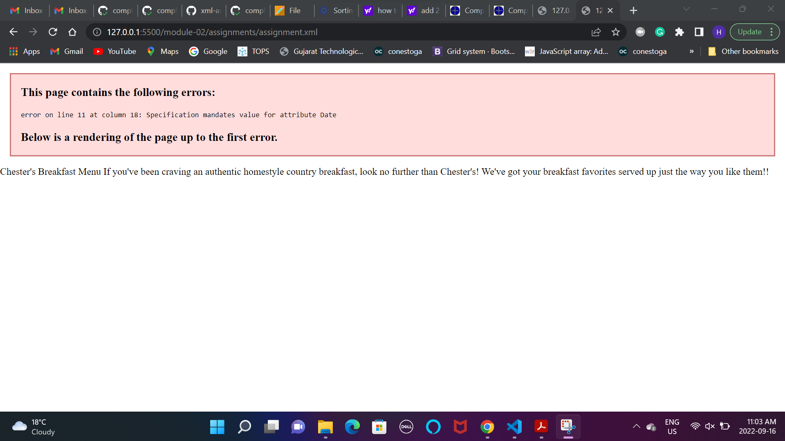
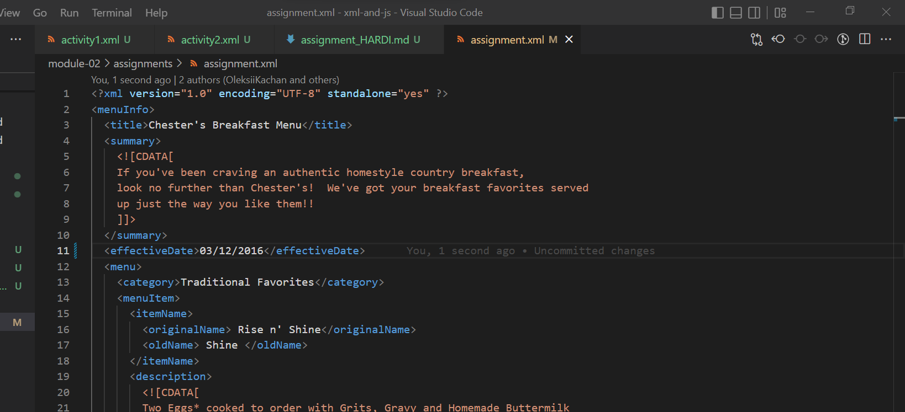
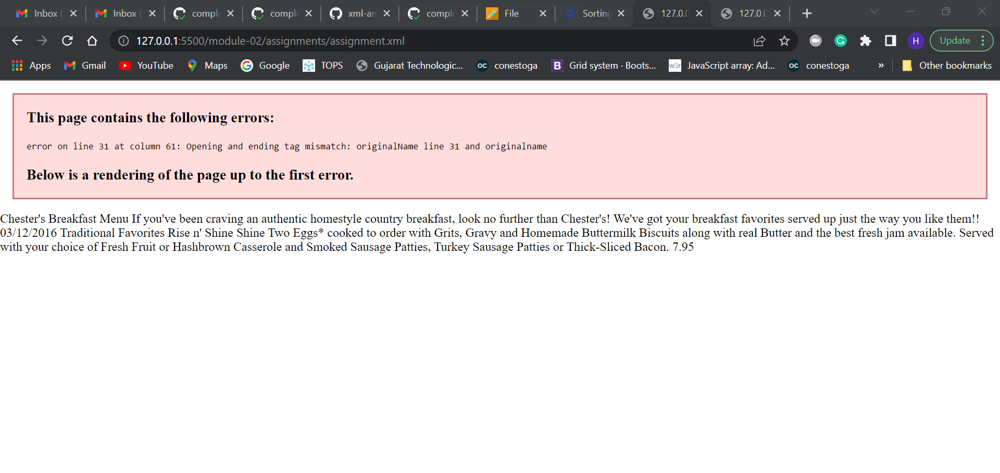
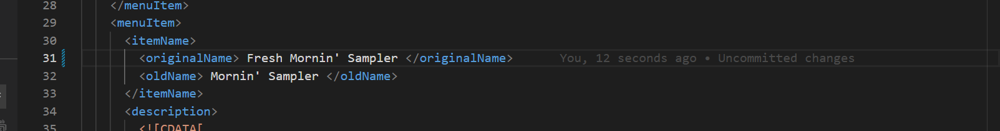
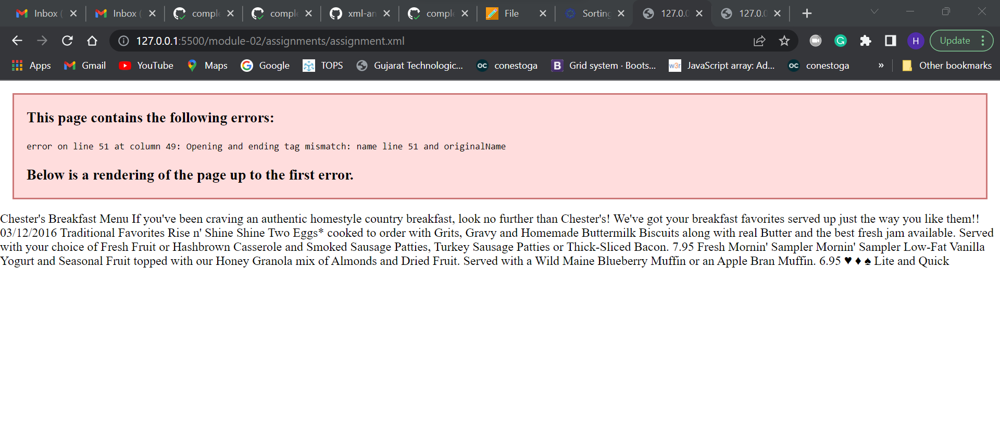
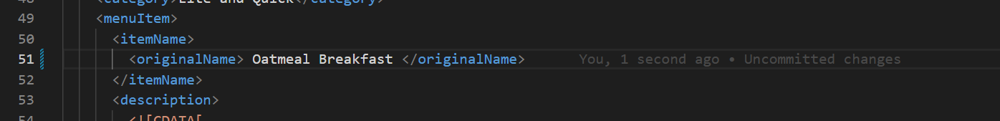
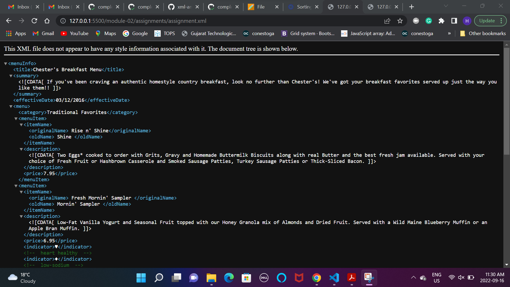

Ans1:
There are 3 errors in the assignment.xml file. All the erros are related to the syntax of the Tags.
1) First error is in line 11. There should be no space between the tag name.
2) Second Error is in line 31. The name of tags should be same for tag opening and tag closing.
3) Third Error is in line 51. Names of the opening tag ad closing tage should be name.

Ans2:
There are no special characters used in the file. But CDATA is used to breaklines in between the texts and arranhe the text in proper formate. User can easily read it.

Ans4:
The first line in the document showing the version and encoding type is the prolog as well as the comments added are the part of prolog.
The document body describes the content to the file.
The processing instruction is present in the second line of the code where the stylesheets are linked.
The epilog are the final comments there are present at end in which Student name and studet ID is commented.

