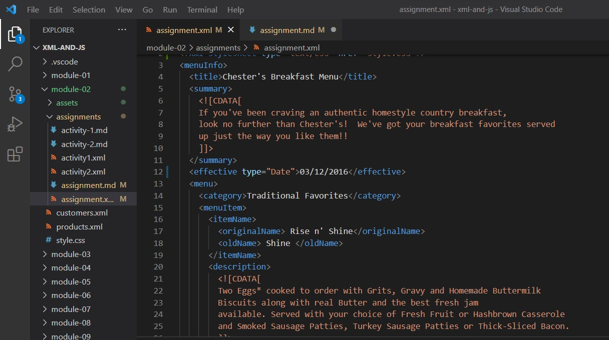
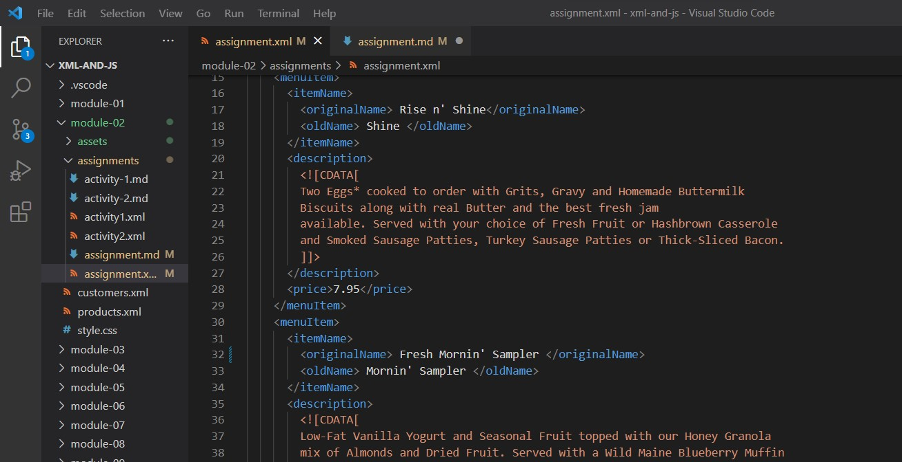
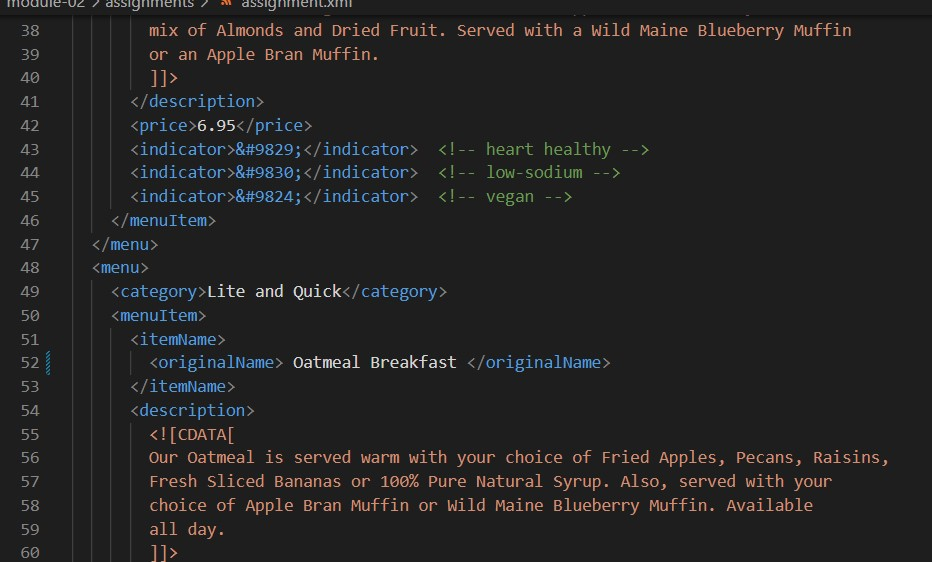
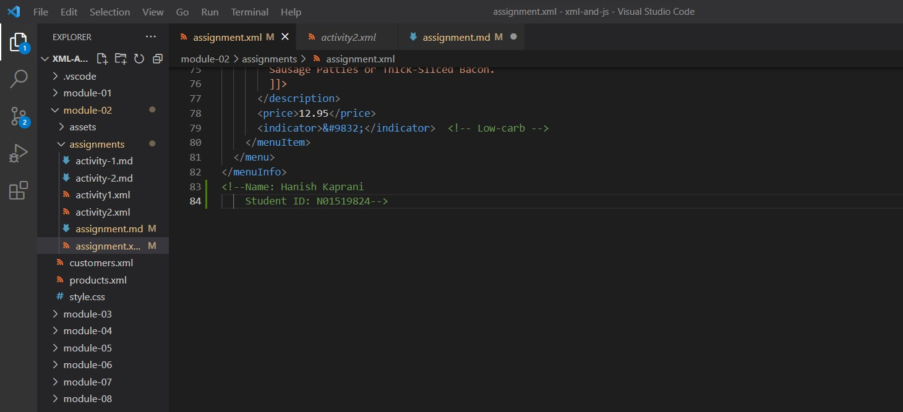
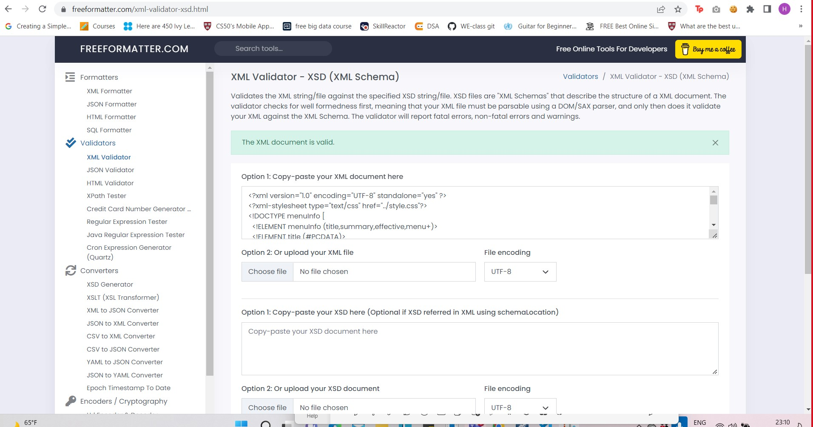
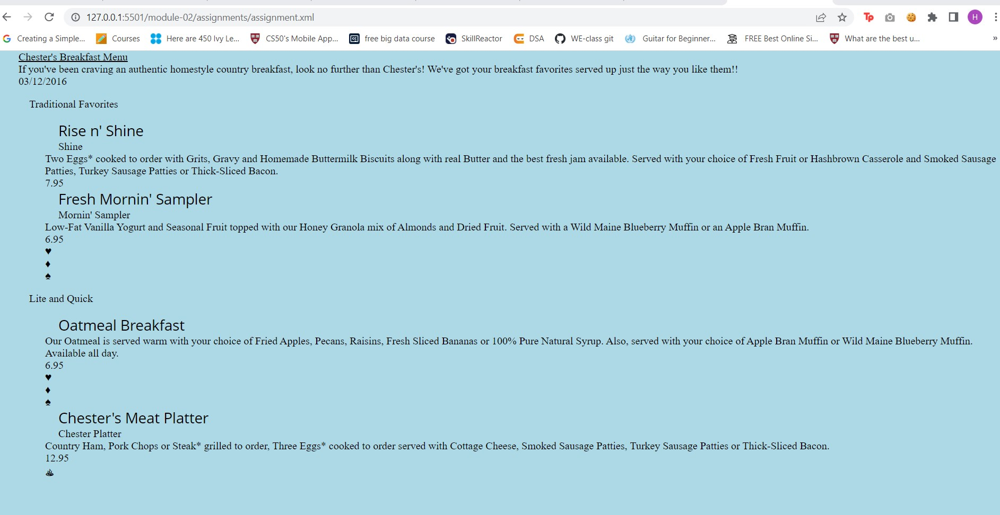

# Assignment 1

1. Open `module-2/assignments/assignment.xml` in your browser. Are there any errors? Explain the error and fix it.

error 1: Date attribute hasn't been specified for the effective tag.
corrected: 

error 2: Effective tag doesn't need date arrtibute again at the end.
corrected: 

error 3: Line 31 name of tag originalName is different at start and end.
corrected: 

error 4: Line 51 name of tage original name is different at the start and end.
corrected: 
 
2. What is the use of CDATA block in this document?

-> CDATA block is used to mark a particular block of data as just characters, so that it doesn't get detected as markup so that we can use special characters as well. For example we have used it in the description of the item in this document.

3. Add comment line to the end of file which contains you name and student id.
   

4. Identify prolog, document body, and epilog in the document. Are there any processing instructions?
 The prolog is at the start of the document and here it will be : 
 <?xml version="1.0" encoding="UTF-8" standalone="yes" ?>
 <?xml-stylesheet type="text/css" href="style.css"?> and the DTD.

The document body will conatin all the content inside the root element , that is : <menuInfo>

The epilog will contain any comments or instructions after the document body, here it will be student name and id comment :
<!--Name: Hanish Kaprani
    Student ID: N01519824--> 

5. Add inline DTD for this document.

<!DOCTYPE menuInfo [
  <!ELEMENT menuInfo (title,summary,effective,menu+)>
  <!ELEMENT title (#PCDATA)>
  <!ELEMENT summary (#PCDATA)>
  <!ELEMENT effective (#PCDATA)>
  <!ATTLIST effective date CDATA #IMPLIED>
  <!ELEMENT menu (category,menuItem+)>
  <!ELEMENT category (#PCDATA)>
  <!ELEMENT menuItem (itemName,description,price,indicator*)>
  <!ELEMENT itemName (originalName,oldName?)>
  <!ELEMENT description (#PCDATA)>
  <!ELEMENT price (#PCDATA)>
  <!ELEMENT indicator (#PCDATA)>
  <!ELEMENT originalName (#PCDATA)>
  <!ELEMENT oldName (#PCDATA)>
]>

6. Verify that file is well-formed and valid.
  

7. Create `style.css` file and link it to the file. Add the following styles to the .css:

- Change font-size of `originalName`
- Display each `category` on the new line
- Add any other css-rule

Create `module-2/assignments/assignment_YOURNAME.md` and add your theory answers. Add screenshots of each step to the file (Refer `module-1/assignments/evaluation-1.md` on how to add image to md file)

<!-- Name: Hanish Kaprani
    Student ID: N01519824 -->