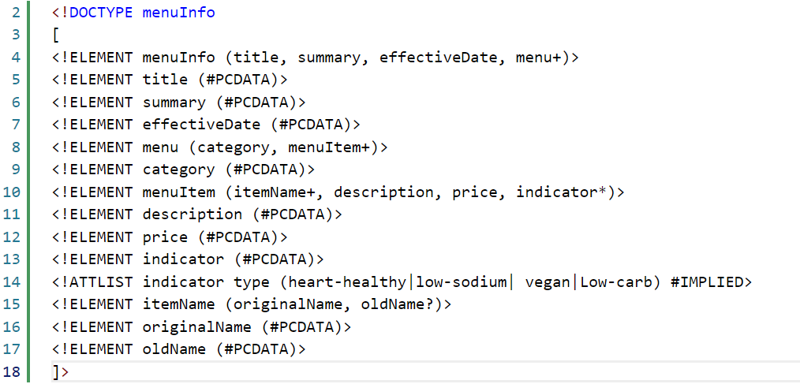
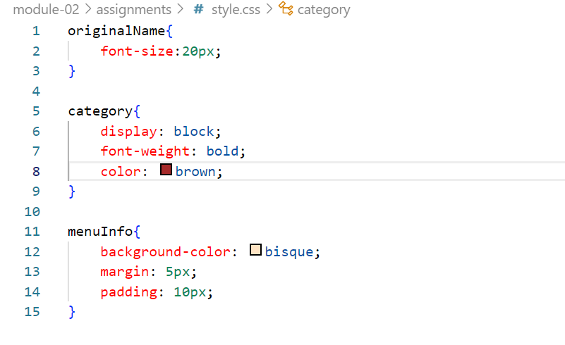

#Assignment-1

#Name: Hinal Amin
#ID: n01530824

Question 1.

-> error1:
There is a space in a tag of <effective date> but in the XML there should not be a blanckspace in the tag.

--> error2:
There is missing attribute of the tag named as <indicator>.

-->error3:
The opening tag have different name than closing tag.

Question 2.

-- Basically, CDATA is the block of charecter data (text).
-- Here,in this document, CDATA is required because we need to write the whole summary of item inside a one tag.

Question 3.

Question 4.

-- Prolog occurs before the body of doccument which includes XML declaration, processing instruction, some comments, processing instuction, document type declaration.
-- Here, in this document, XML declaration is the prolog as it occurs before the document body.

-- Document body contains tree structure.
-- It starts with root tag.
-- Here, in this document, everything inside the root tag i.e.<menuInfo> is consider as Document body.

-- Epilog is optional which contains final comment.
-- Here, in this document, the final comment which includes name and student number is consider as epilog.

-- There are not any processing instruction in this document as it includes some special instruction or any css.

Question 5.

Question 6.

Question 7.

