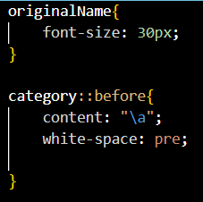
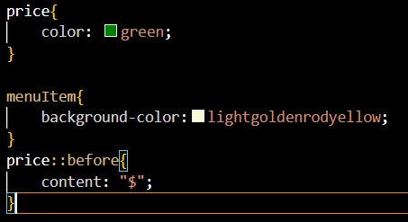

1. Open `module-2/assignments/assignment.xml` in your browser. Are there any errors? Explain the error and fix it.
    Error 1- <effective Date>03/12/2016</effective Date> <--Invalid tag declaration.Space is not allowed declaration of tags.
        Solution - <effectiveDate>03/12/2016</effectiveDate>
        

    Error 2 - <originalName> Fresh Mornin' Sampler </originalname> <--Invalid tag declaration.DIfference in opening and closing tag.
        Solution - <originalName> Fresh Mornin' Sampler </originalName>
        

    Error 3 - <name> Oatmeal Breakfast </originalName> <--Opening and closing tag should be same.
        Solution - <orignalName> Oatmeal Breakfast </orignalName>
        

2. What is the use of CDATA block in this document?
    CDATA Block enable us to use special entities such as "&","," and text which is not required to be parsed by the parser.
    In this document, CDATA block is used to put comma "," a special entity in description of items on the menu and what other items are served with different items. 
    

    
3. Add comment line to the end of file which contains you name and student id.
    

4. Identify prolog, document body, and epilog in the document. Are there any processing instructions?
    It contains prolog but only the declaration part which is a declaration of XML.
        

    It does contain document body and its start from menuInfo(<menuInfo>) tag.

    No, It does not contain epilog.

    No, it does not contain any processing instructions.(before adding external css file as required in Question 7)

5. Add inline DTD for this document.
    

6. Verify that file is well-formed and valid.
    

7. Create `style.css` file and link it to the file. Add the following styles to the .css:

    - Change font-size of `originalName`
    - Display each `category` on the new line
        
    - Add any other css-rule
        