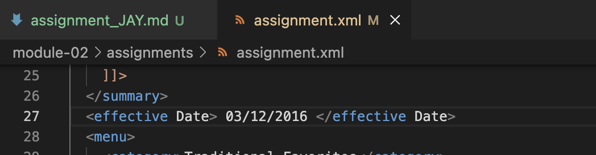
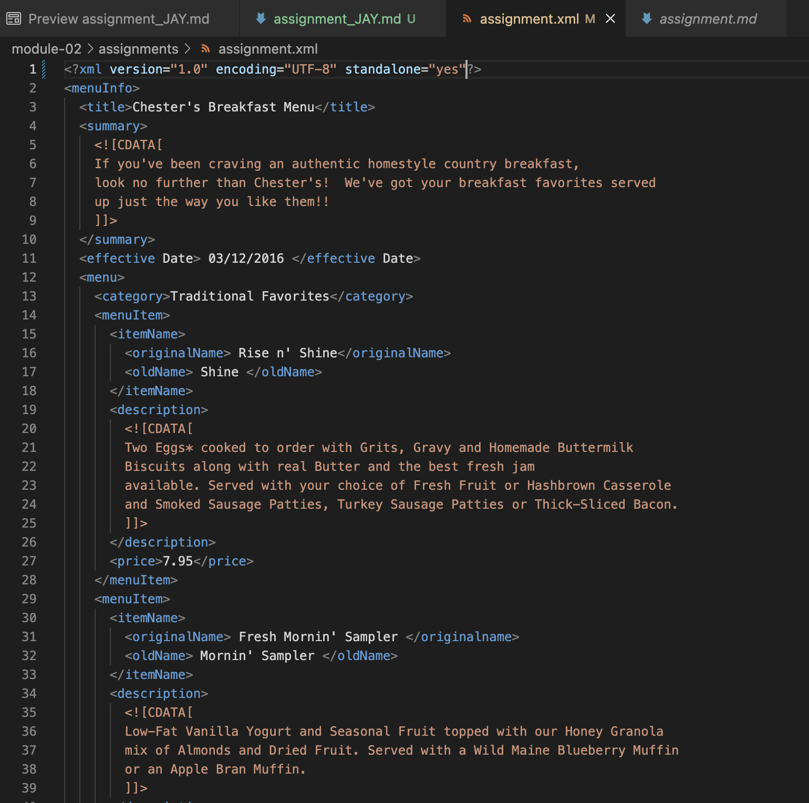
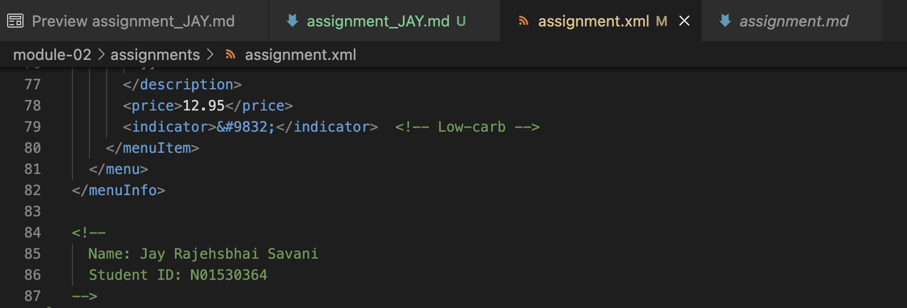
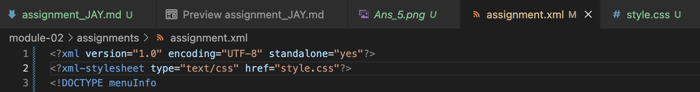
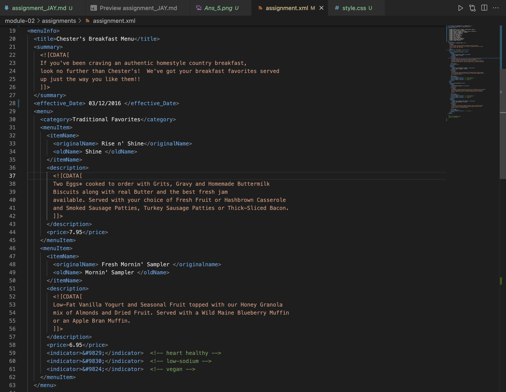
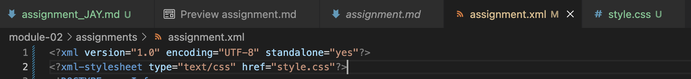
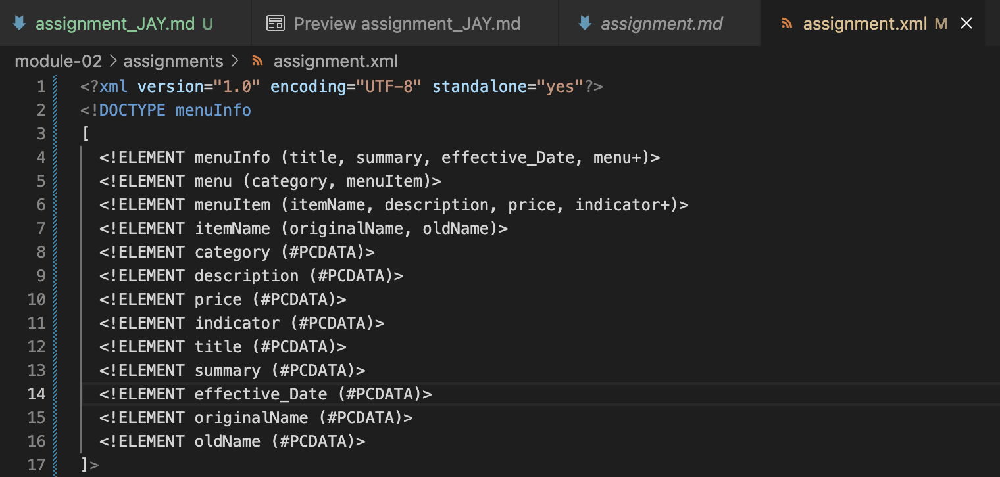

# Assignment 1: Theory Answers

1. We can see error, where we can see that there is a space at the between two element name called effective Date. 
=> As we learned in lecture, we can not put space between two elements name.

=> There are not same name of the element called originalName as shown below.

2. We can clearly see that CDATA is used to provide proper information and description about each and every item in their breakfast menu.
=> Itnshows all the information as how it will be come to the customers and how you have to deal with that item.

3. We can add comment by using the same brackets as in html.

4. 
=> Prolog

=> Document Body

=> Processing Instruction

=>  No Epilog is here in this document.

5. 

6. 
