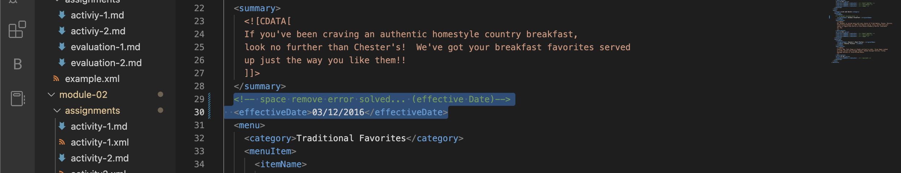
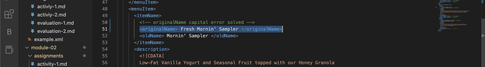
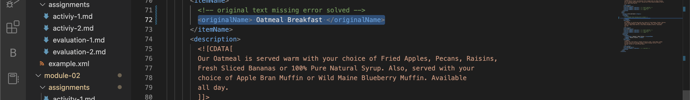
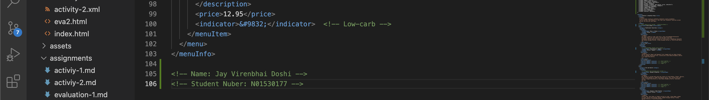
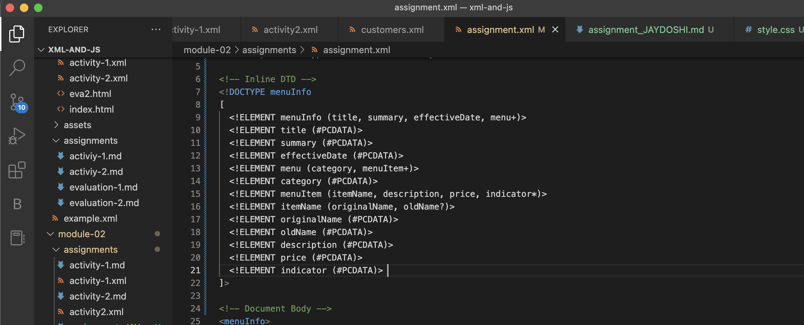
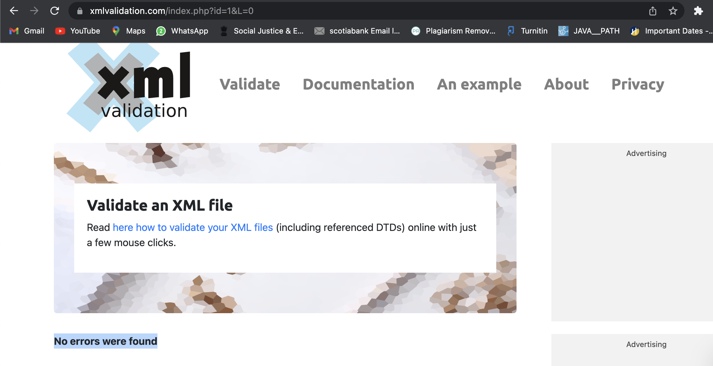

# Assignment 1

1. Open `module-2/assignments/assignment.xml` in your browser. Are there any errors? Explain the error and fix it.
ANS: I resolved 3 error in assignment.xml file. The first error is a spacing in "effective Date". Second is capital error in "originalName" and last error is text missing in "originalName".

# Images:

 

2. What is the use of CDATA block in this document?
ANS: In this document a CDATA section is used to mark a section of an XML document so that the XML parser only recognises character data and not markup.

3. Add comment line to the end of file which contains you name and student id.
ANS: 
# Images:

4. Identify prolog, document body, and epilog in the document. Are there any processing instructions?
ANS: In this document prolog contains only xml declaration.
     In this document has document body from <menuInfo> tag.
     Yes this document has processing instruction: "<?xml-stylesheet type="text/css" href="style.css"?> "  

5. Add inline DTD for this document.
ANS:
# Images:

6. Verify that file is well-formed and valid.
ANS:
# Images:

7. Create `style.css` file and link it to the file. Add the following styles to the .css:

- Change font-size of `originalName`
- Display each `category` on the new line
- Add any other css-rule

ANS:
# Images:

Create `module-2/assignments/assignment_YOURNAME.md` and add your theory answers. Add screenshots of each step to the file (Refer `module-1/assignments/evaluation-1.md` on how to add image to md file)