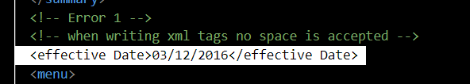
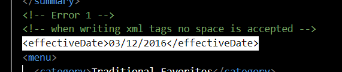
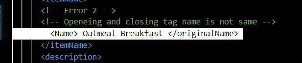
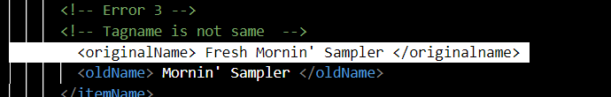
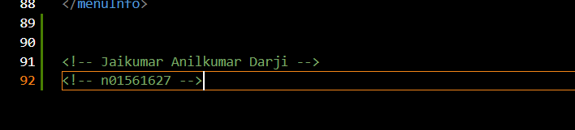
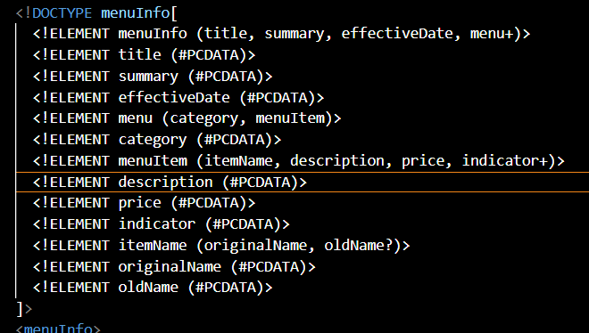
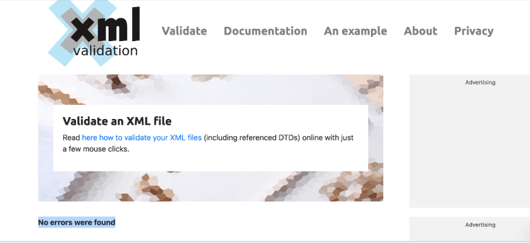
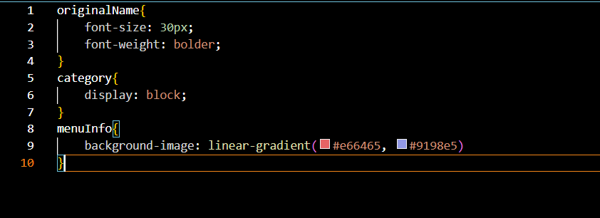

# Assignment 1

1. Open `module-2/assignments/assignment.xml` in your browser. Are there any errors? Explain the error and fix it.

Answer:-
 There are 3 error in xlm script
Error 1:- 
Solution 1:

Error 2:- 
Solution 2:

Error 3:- 
Solution 3:

2. What is the use of CDATA block in this document?

Answer:- CDATA in XML is treated as pure data, all the data in the CDATA including XML it is consider as data not as markup,
        In this document CDATA block is used to give description about the Item.

3. Add comment line to the end of file which contains you name and student id.
Answer:- 

4. Identify prolog, document body, and epilog in the document. Are there any processing instructions?

Answer:- Prolog in this XML file is:= <?xml version="1.0" encoding="UTF-8" standalone="yes" ?> 
        Epilog in this file is:= <menuInfo>
        Processing instuction is tag which start with "<?" and end with "?>"
        Processing instuction in this file is:=<?xml version="1.0" encoding="UTF-8" standalone="yes" ?> 

5. Add inline DTD for this document.

Answer:= 

6. Verify that file is well-formed and valid.

Answer:= 

7. Create `style.css` file and link it to the file. Add the following styles to the .css:

Answer:= 
- Change font-size of `originalName`
- Display each `category` on the new line
- Add any other css-rule