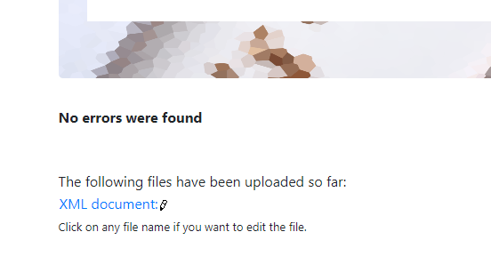

1)

1st error occurred because the attribute was not mentioned for the element date. Once it is changed it became fine.
2nd error occured because the closing tag originalName was not in the same case as opening tag once changed it became fine.
3rd error occured because the openening tage didn't have originalName instead it had Name. Once changed it worked.

2)

 <![CDATA[
        Our Oatmeal is served warm with your choice of Fried Apples, Pecans, Raisins,
        Fresh Sliced Bananas or 100% Pure Natural Syrup. Also, served with your
        choice of Apple Bran Muffin or Wild Maine Blueberry Muffin. Available
        all day.
        ]]>

Inorder to avoid character reference as it becomes difficult to read the content wherein and becomes &and; < becomes
&lt; we can keep this data in CDATA block. It is treated as pure data content. Here the character data is not processed.
Here the whole block is considered as character data. It can contain markup characters such as >,< and &.
So in the above case the whole data is considered as one by the XML.

3) <!--Name: Jais Jose , ID: N01516859 Comment added in the EOF-->

4) Prolog:It is the initial part of the xml document wherein it is divided into 4 main parts
-xml declaration
-processing instructions
-comment lines
-Document typle declaration

In the code we have the first line which is xml declaration as the prolog. It basically tells that the document is written in XML
and how the code needs to be interpreted by the program.
<?xml version="1.0" encoding="UTF-8" standalone="yes" ?>

Document body : It contains the document's content in a hierarchial tree structure
in this case all the code enclosed under <menuInfo> and </menuInfo> comes under document body.
The hierarchial structure is menu--menuItem--itemName

Epilog - It is the final comment and is optional. It also contains processing instructions. Processing Instructions are a way for the XML
content to deliver special instructions to the XML parser. During spell check of a document you might need to choose a particular language.
In this code there is no epilog or processing instructions.

5) DTD
[
<!ELEMENT menuInfo (title,summary,Date,menu+)>
<!ELEMENT title (#PCDATA)>
<!ELEMENT summary (#PCDATA)>
<!ELEMENT Date (#PCDATA)>
<!ATTLIST Date type (effective) #REQUIRED>
<!ELEMENT menu (category,menuItem+)>
<!ELEMENT category (#PCDATA)>
<!ELEMENT menuItem (itemName,description,price,indicator*)>
<!ELEMENT itemName (originalName,oldName?)>
<!ELEMENT originalName (#PCDATA)>
<!ELEMENT oldName (#PCDATA)>
<!ELEMENT description (#PCDATA)>
<!ELEMENT price (#PCDATA)>
<!ELEMENT indicator (#PCDATA)>

]>

6)

7)

