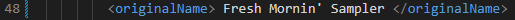
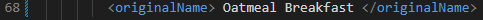
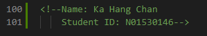
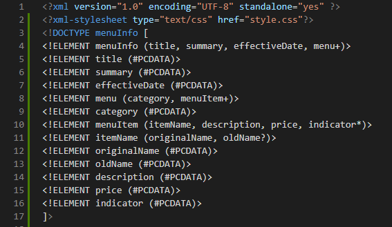
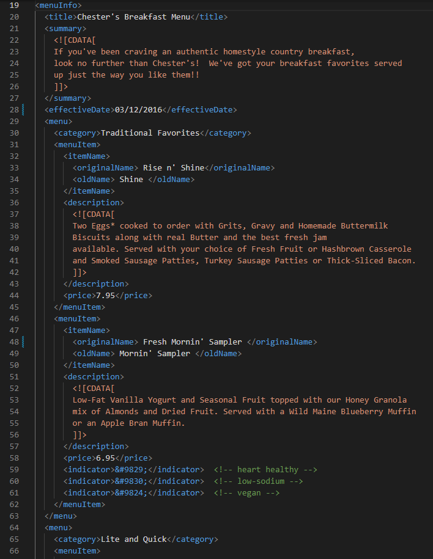
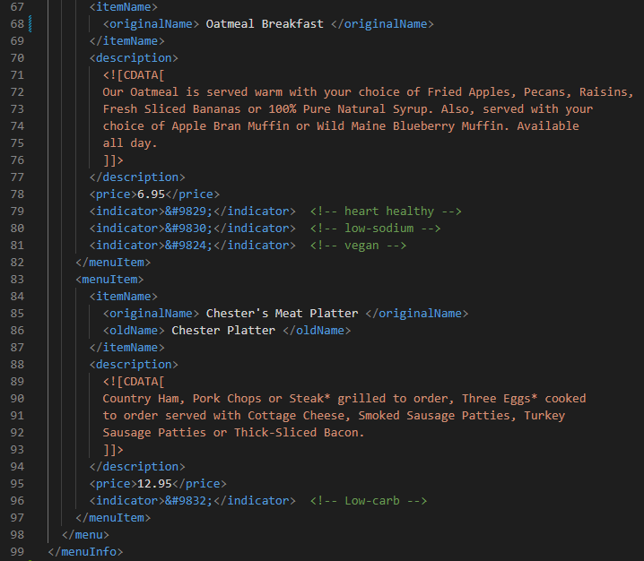
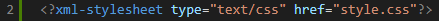
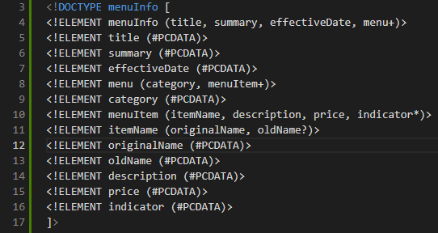
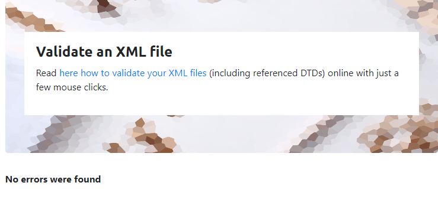
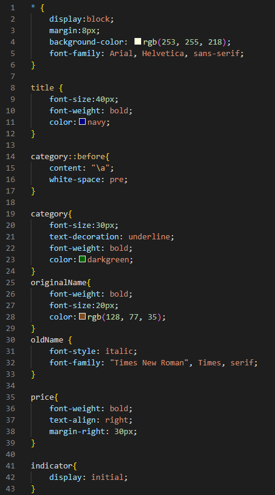

# Assignment 1

1. There are some errors shown as below, and fixed in the xml document:
    - For the `<effective Date>` in line 28, 'Date' should follow the 'effective'. e.g. `<effectiveDate>`, `<effective_date>`, etc. 
    After fixing: 
    

    - In line 48, the closing tag should be the same as the opening tag. Therefore, `</originalname>` should be changed to `</originalName>` 
    After fixing: 
    

    - In line 68, the name of the opening tag `<name>` is not match with the name of the closing tag `</originalName>` . The opening tag should be changed to `<originalName>`  
    After fixing: 
    

2. The CDATA block in this document will only interpret the content as character data. The markup or special symbol will be treat as character data in the CDATA block.

3. Add comment line to the end of file which contains you name and student id. 

4.  Prolog (line 1-17): 
    
    
    Document Body (line 19-99): 
     
    

    Epilog (line 100-101):  
     
There is a processing instruction in the prolog: 

5. Add inline DTD for this document. 

6. Verify that file is well-formed and valid. 

7. Create style.css file and link it to the file. Add the following styles to the .css: 
style.css: 
 
xml (line 2): 
