<!-- Assignement-1
    Kishan Patel
    N01554260 -->

1.  Open `module-2/assignments/assignment.xml` in your browser. Are there any errors? Explain the error and fix it.

    Answer-> Yes. There are total 3 Errors in the assignment.xml file which are as follows:
    Error-1: In this error, The name of the tag ("effective Date") have space in it on Line-11 which is not valid as per rules of XML. So,
    I removed space ("effectiveDate") and solved the error.
    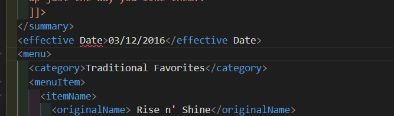

    Error-2: In this error, The name of the Starting ("originalName") and Ending ("orignalname") tags are not same on the Line-32 which is not appropriate as per the rules. So, I changed the name to appropriate name and solved error.
    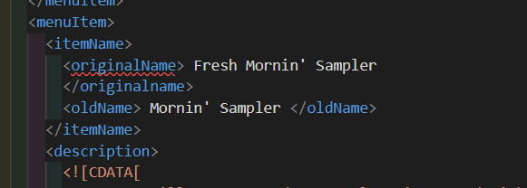

    Error-3: In this error, The name of the Starting ("name") and Ending ("orignalName") tags are not same on the Line-55 which is not appropriate as per the rules. So, I changed the name to appropriate name and solved error.
    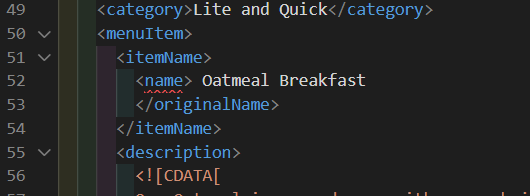

2.  What is the use of CDATA block in this document?

    Answer-> CDATA stands for Character Data and it means that the data in between these strings includes data that could be interpreted as XML markup, but should not be.
    Here it is used for to display the string or group of charater data as description of item and summary of the menu which will not be interpreted by XML.
    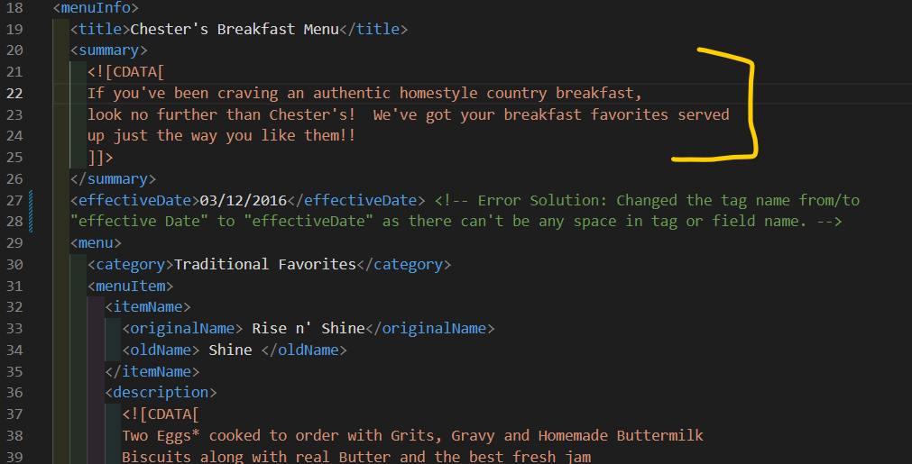

3.  Add comment line to the end of file which contains you name and student id.

    Answer-> You can see the comment which contains the name and student id in the line 90 of assignment.xml file.
    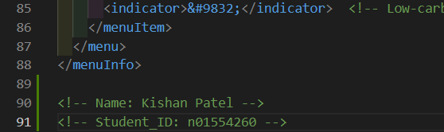

4.  Identify prolog, document body, and epilog in the document. Are there any processing instructions?

    Answer-> Prolog Consists of XML declaration of document.
    In this document prolog is Line-1. ("<?xml version="1.0" encoding="UTF-8" standalone="yes"?>")

    Document body is the part that start after prolog which is between root element.
    In this document, document body starts from Line-3 to 89. ("menuInfo is the root element.")

    Epilog is the part after the root element which is in the comment.
    In this documebt, epilog starts from Line-91 & 92. ("Name and Student id is the epilog here.")
    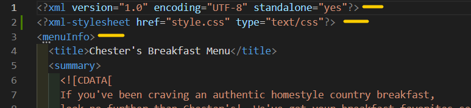
    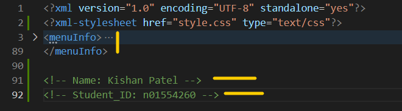

5.  Add inline DTD for this document.

    Answer-> The inline DTD for this doucment is from Line-3 to 17 in assignemnt.xml file.
    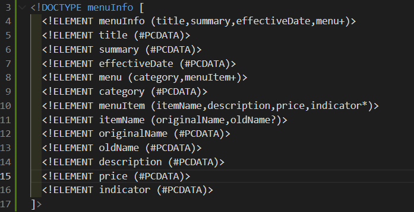

6.  Verify that file is well-formed and valid.

    Answer-> To verify the valid and wellformed file we are using xml validator site as per the following image.
    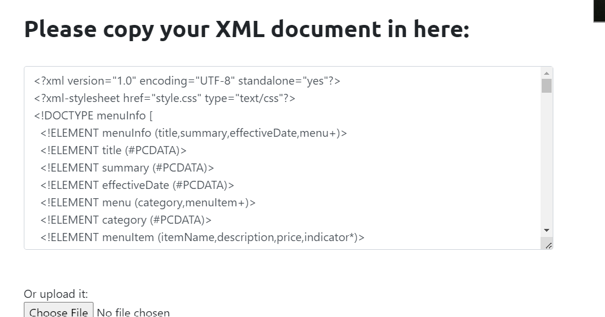
    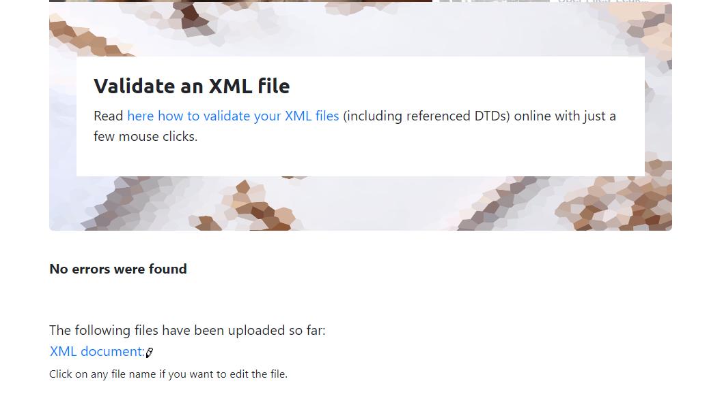

7.  Create `style.css` file and link it to the file. Add the following styles to the .css:

    - Change font-size of `originalName`
    - Display each `category` on the new line
    - Add any other css-rule

    Answer-> You can see the link of style.css, content of the style.css and its before and after effect on file in this images.
    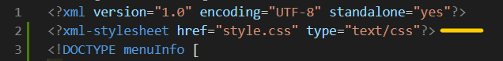
    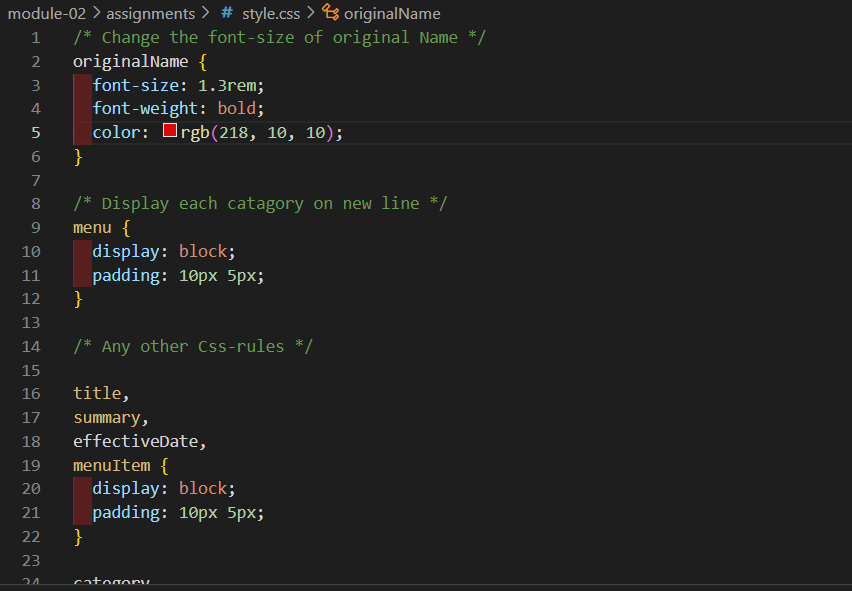
    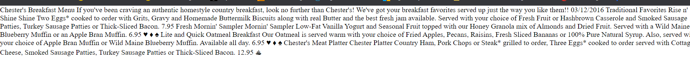
    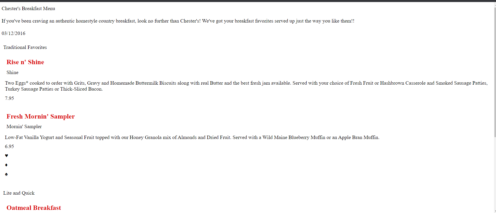
