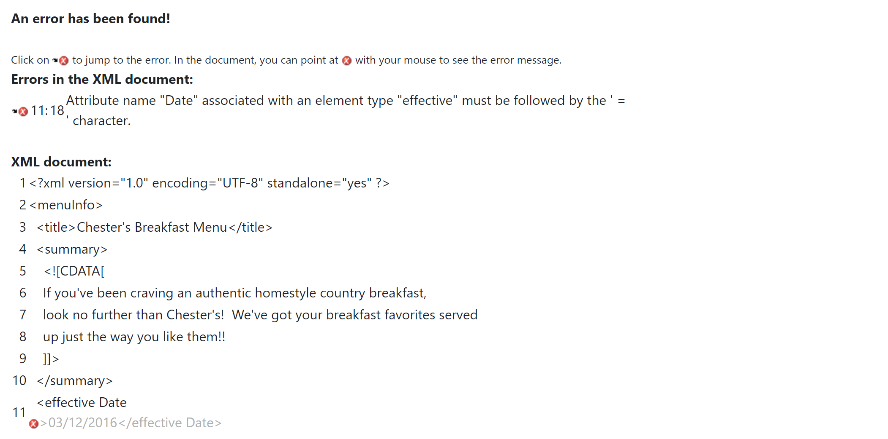
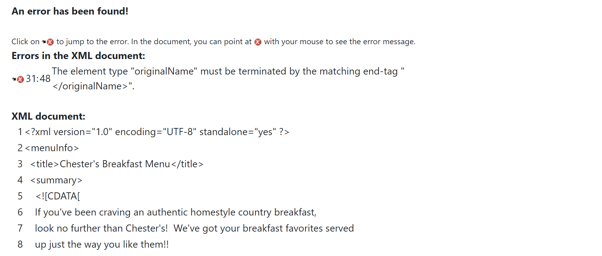
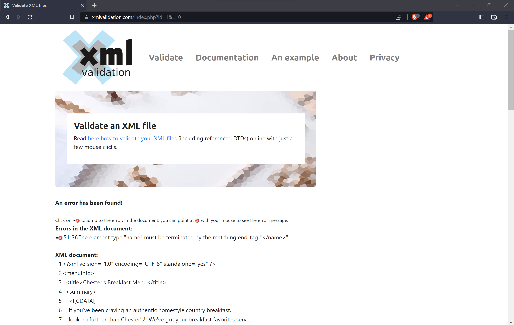
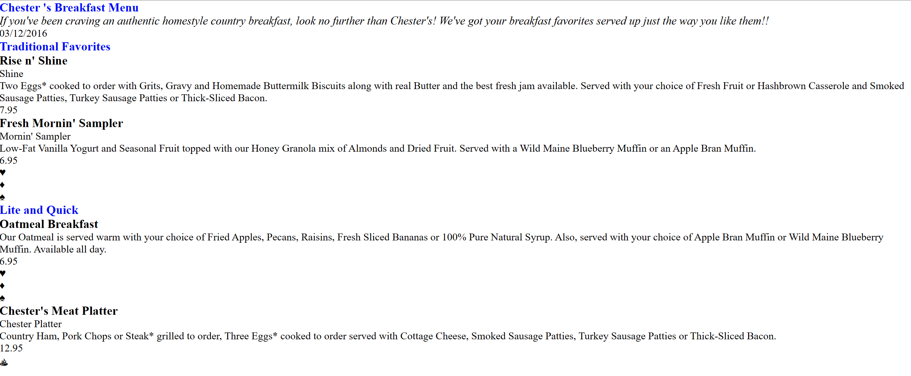

# Assignment 1
# Leon Czarlinksi - n01541167

1. in the XML file I identified each error with a comment. 
    1.1 The error is that there was a space between "effective" and "date" in the element, so I changed to "effectiveDate" 
    
    1.2 The error here is that the closing tab in the element was wrongly writen.
    
    1.3 The open tab of the element was writen wrong. I changed to "originalName"
    
    After the modification there were no erros 
     
2. The use of the CDATA in this document is to store sumary of the menu and descriptions of the items. Since CDATA is a section that may contain most markup characters, such as <, >, there is no need to use entity reference
4. The document has a prolog and a document body, but there is no epilog. There is no processing instructions as well. But on item number 7 I created a css as processing instructions. The identifications are in the xml file.
5. in the xml file and validated in the XML validator
    
6. The document contains a lot of symbols that I substituded by Entity References, such as sigle quote --> line 34, 49, 50 and 86
7. CSS file created and is named styles.css
    
    