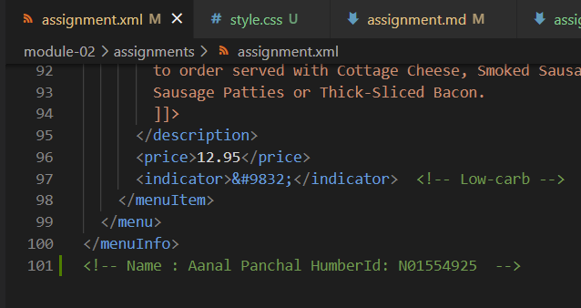
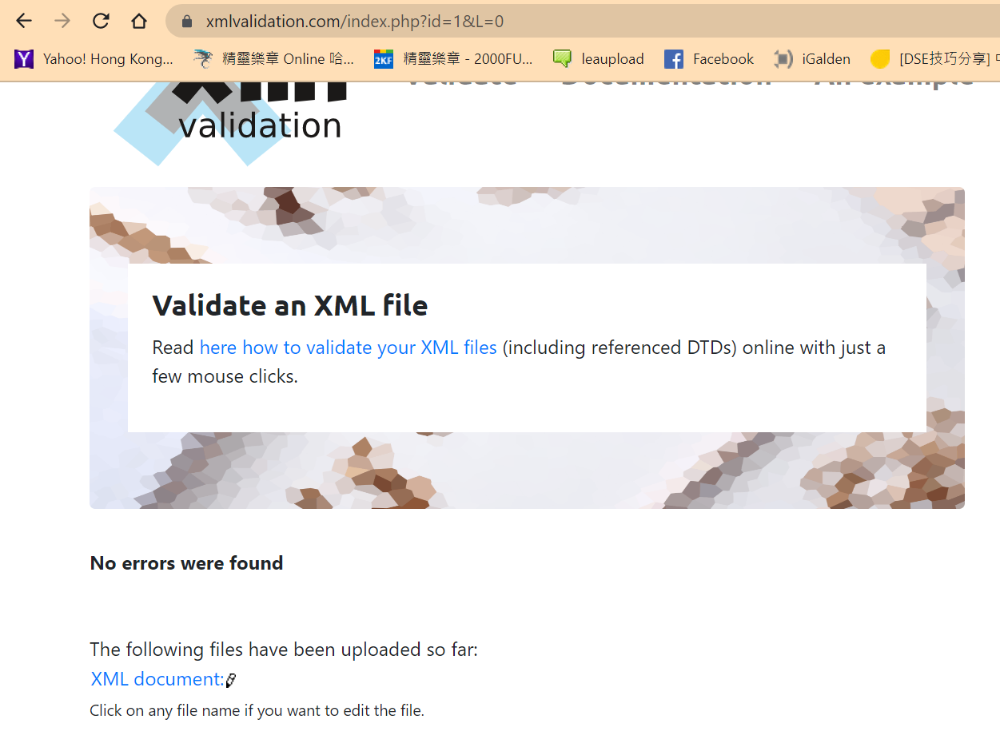

# Assignment 1
## Question 1
The first mistake is in line 11
`<effective Date>03/12/2016</effective Date>`

There should not be space inside the tag so it should be ammended to 
`<effectiveDate>03/12/2016</effectiveDate>`

The second mistake is in line 31
`<originalName> Fresh Mornin' Sampler </originalname>`

XML tags are case-sensitive so we should amend it to 
`<originalName> Fresh Mornin' Sampler </originalName>`

The third mistake is in line 51
`<name> Oatmeal Breakfast </originalName>`

Opening and closing tag should be consistent. The correct version is 
`<originalName> Oatmeal Breakfast </originalName>`

## Question 2
A CDATA section is used to act as a block of text which the XML only treat it as character data. In the CDATA section in assignment.xml, it contains some special character like apostrophe. We will have to use character or entity references if we do not include these content in CDATA section.

## Question 3

## Question 4
Prolog
`<?xml version="1.0" encoding="UTF-8" standalone="yes" ?>`
Document body
It is between the `<menuInfo></menuInfo>` 
Epilog
`<!--LONG TENG PAK n01526495-->`
There is no processing instructions.

## Question 5

## Question 6
The file is well-formed and valid.

## Question 7

