1. 
-->Changed from effective Date to "effective"
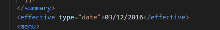

-->Originalname tag was not written in Camel case while closing it.
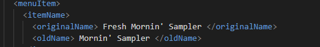

-->Name tag is closed starting  with a Capital letter.
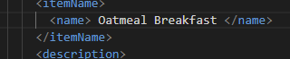

2.CDATA stands for Character Data  is a data where the parser doesn't parse the data mentioned in it.

3.Added name and student ID atf the end of the document.
<!--Name:B.Ramakrishna Likith
Humber ID: N01553398-->
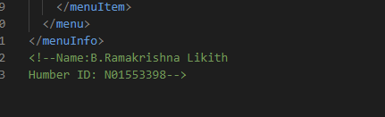

4.Prolog:
<?xml version="1.0" encoding="UTF-8" standalone="yes" ?>
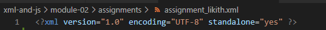

Document Body:
<menuInfo>
...
</menuInfo>
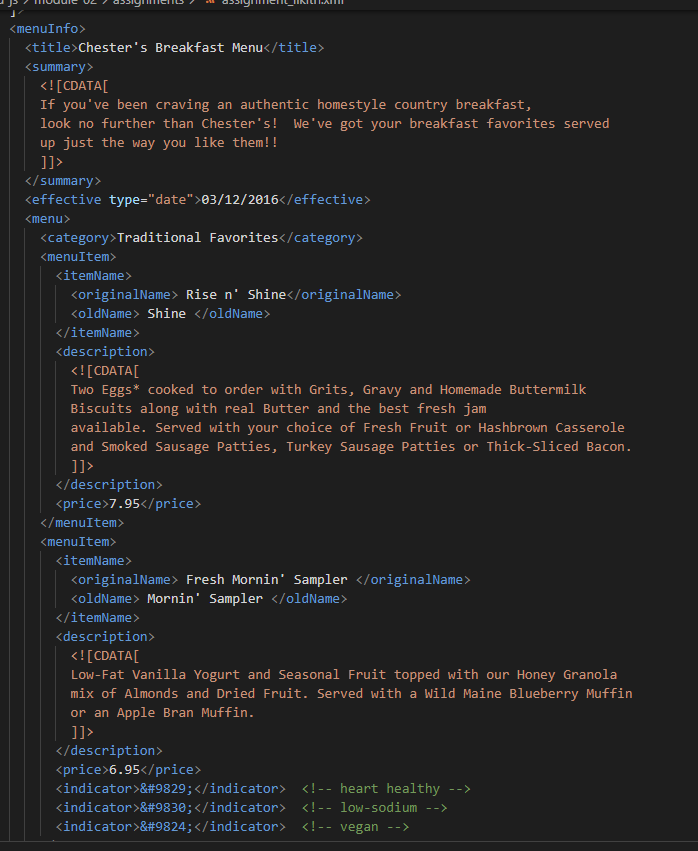

epilog:
<!--Name:B.Ramakrishna Likith
Humber ID: N01553398-->
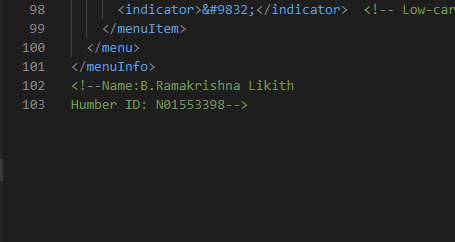

5.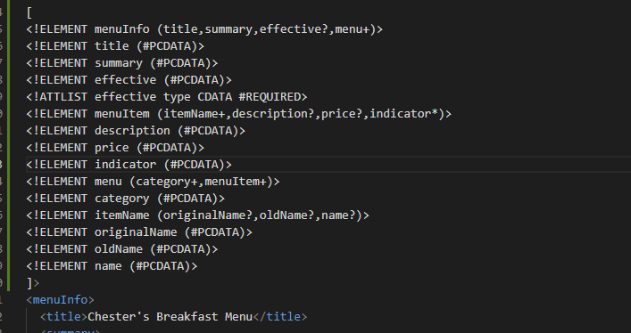

6.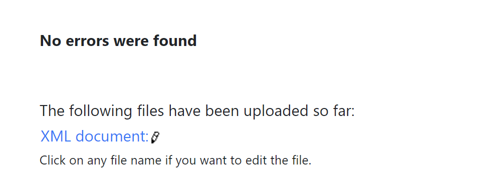

7.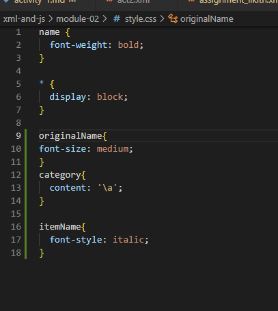
  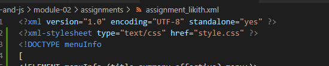

