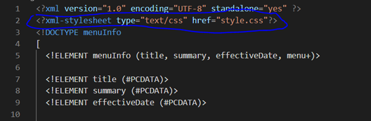

# Assignment 1

1. Open `module-2/assignments/assignment.xml` in your browser. Are there any errors? Explain the error and fix it.

First error:
Attribute name "Date" associated with an element type "effective" must be followed by the ' = ' character.
<effective Date>03/12/2016</effective Date>

Because of the space between the two, it was considering "Date" as an attribute of element type "effective" and asking to use "=" sign to assign the attribute.

The error can be fixed by removing the space:
<effectivDate>03/12/2016</effectiveDate>

Second error:
The element type "originalName" must be terminated by the matching end-tag "</originalName>".
<originalName> Fresh Mornin' Sampler </originalname>

There's a casing error in the closing tag. The 'N' in the "orginalname" should be capital as it was defined in the opening tag.
The name should be same in both opening and closing tag.

The updated line would be:
<originalName> Fresh Mornin' Sampler </originalName>

Third error:
The element type "name" must be terminated by the matching end-tag "</name>".
<name> Oatmeal Breakfast </originalName>

Both opening and closing tag should match. In the whole document body, "originalName" element is used.
So, I used the same name for the opening tag.

The fixed line would be:
<originalName> Oatmeal Breakfast </originalName>

All the errors are fixed now. The xml is validated.

2. What is the use of CDATA block in this document?

CDATA is a block of text. The text defined in CDATA block is considered only as character data and not as mark-up (i.e. not parsed by the parser)
Here, the content written inside the block is treated as regular text.

In this document, the content is related to the description of the meals. Hence, it's wrapped inside CDATA block.

3. Add comment line to the end of file which contains you name and student id.

Comment line is added at the end of file in assignment.xml file.

4. Identify prolog, document body, and epilog in the document. Are there any processing instructions?

Prolog:
It's the information about XML declaration, processing instructions, comment lines and DTD.

XML declaration
<?xml version="1.0" encoding="UTF-8" standalone="yes" ?>

Document body:
It contains the document content.
Everything written between the tags <menuInfo></menuInfo> is the document body.

Epilog:
It's the final comment or processing instructions.
The comment line added in the last.
<!-- NAME: Manmeet Kaur HUMBER_ID: N01536163 -->

Initially, there were no processing instructions inside the document.
After doing all the questions mentioned in the assignment, the final prolog is as follows:

The "stylesheet" added is the processing instructions.

5. Add inline DTD for this document.

Inline DTD is added.

6. Verify that file is well-formed and valid.

Screenshot of xml validation:

7. Create `style.css` file and link it to the file. Add the following styles to the .css:
- Change font-size of `originalName`
- Display each `category` on the new line
- Add any other css-rule

Style added:

