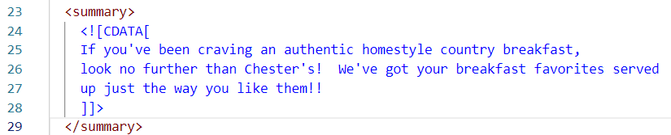
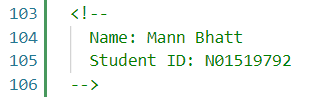
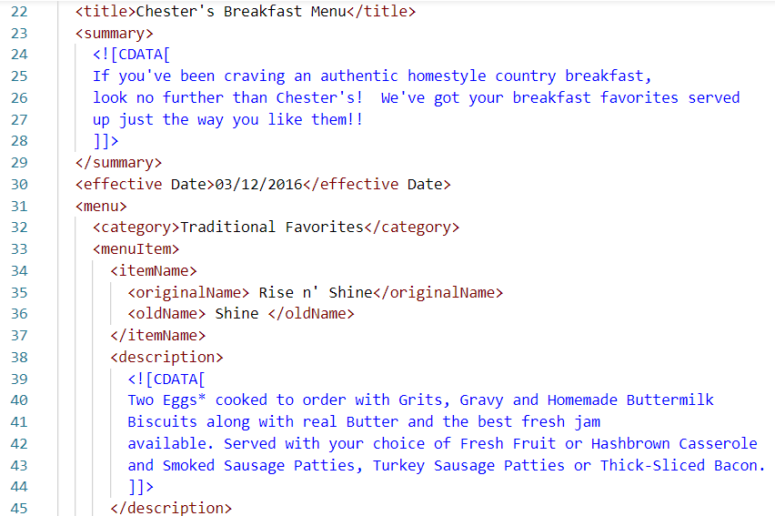
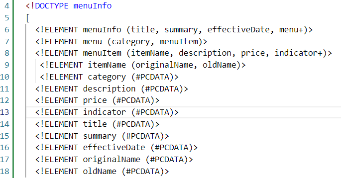
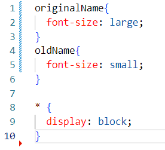

Q1.) 
There is an error in assignment.xml file on line 30.
there is a space in the element name.According the rules element name can not contain any space.

Q2.) 
In this document the CDATA block is used to provide the summary and the description of the main items of 
Chester's Breakfast Menu.
For example, how the particular dish is made and how it is served.

Q3.) 

Q4.) prolog: 
   documnet body: 
   processing instructions: 

Q5.)

Q6.)

Q7.)

