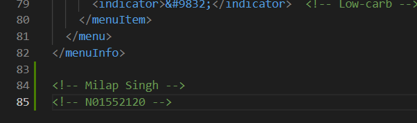
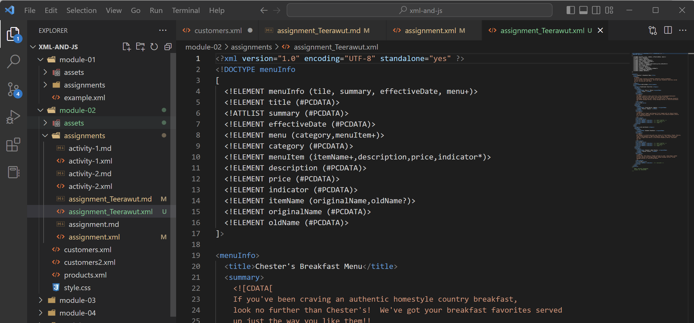

# Assignment 1

1. Errors.
- There are three errors at line no 11,31 and 51 following are the screenshots:

2. What is the use of CDATA block in this document?
- It is block of data which is considered as markup language, but its not parsed by parser. 

3. Add comment line to the end of file which contains your name and student id.

4. Identify prolog, document body, and epilog in the document. Are there any processing instructions?
- prolog is xml declaration in which it describe type declaration.
- body is made up of single root element and contains comments and processing instructions.
- yes this xml file contains process instructions like css file

5. Add inline DTD for this document.
- 
6. Verify that file is well-formed and valid.
-
7. Create `style.css` file and link it to the file. Add the following styles to the .css:

- Change font-size of `originalName`
- Display each `category` on the new line
- Add any other css-rule

