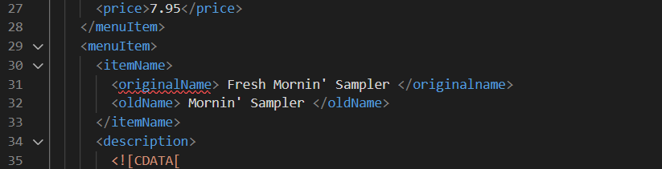

# Name: Naitik Mukeshkumar Panchal
# N-No: N01512962
# assignment 1

1. Explain the errors

-> Here the error consists in the <effective Date> tag where the tag cannot contain any spaces between two words. So to fix the error removed the space like <effectiveDate>.

-> Here the error is in the incorrect end tag, the tag starts with the <originalName> but in the end tag the <originalname> word is in small case. The xml tags are case sensistive. so fixing it with proper case like <originalName>.

-> Here the error is in incorrect start tag. the start tag is <name> but end tag is <originalName>. Hence it can be solved by replacing name with <originalName> tag.

2. What is the use of CDATA block in this document?
-> CDATA block is used to include the character data as it is written. Because sometimes text data contains some special characters which have special meaning in the xml documents, hence to print those character as it and as an escape sequence the CDATA is used. In the document there are text data which contains the -, %, * characters. So that using CDATA we can correctly store those characters as only text.

3. Add comment line to the end of file which contains you name and student id.

-> entered the name and n-number.

4. Identify prolog, document body, and epilog in the document. Are there any processing instructions?

->The XML prolog contains XML declarations, processing instructions, comments and document type declarations, Here the prolog is <?xml version="1.0" encoding="UTF-8" standalone="yes" ?> it only contains the XML declaration which should be at the top of the prolog.
-> The document body contains one root element <menuInfo> and everything inside and including the root element is the XML docment body. 
-> The epilog is optional for XML documentations, here in the assignment.xml file there's no epilog describing the file but .

-> The processing instructions is written inside <? ?> tag. There are no processing instructions present in the document. If we insert the CSS stylesheet then it is a processing instruction.

5. Add inline DTD for this document.

-> Inline dtd is added.

    