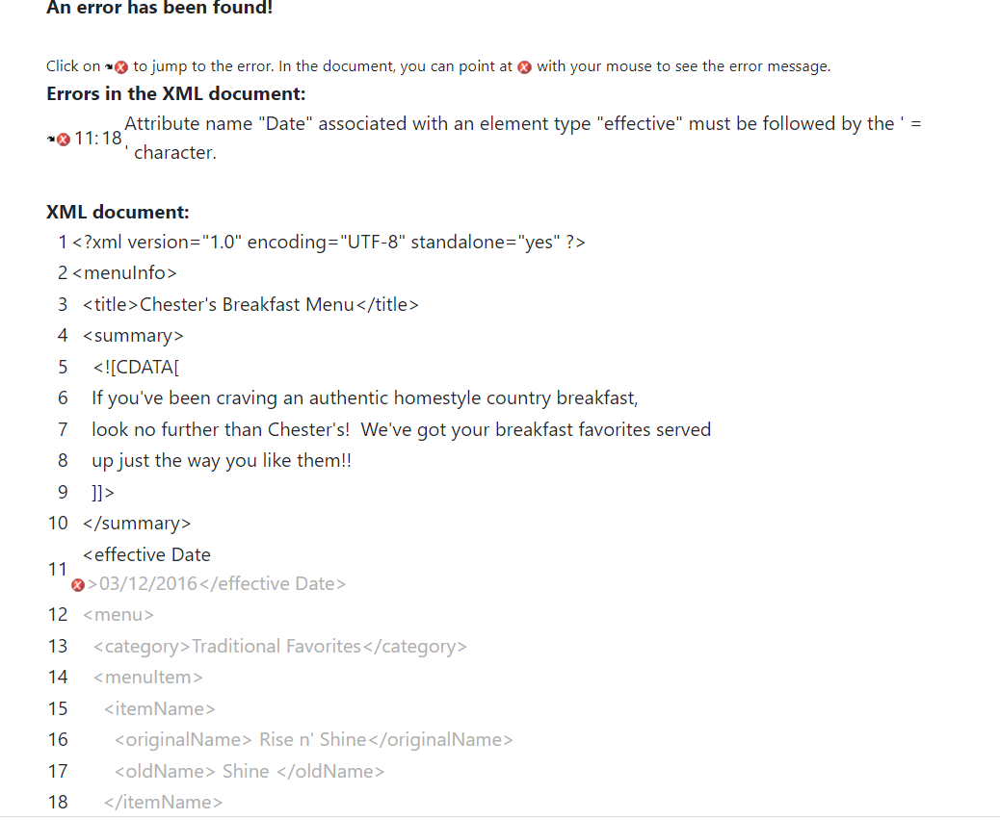
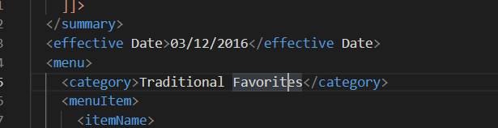
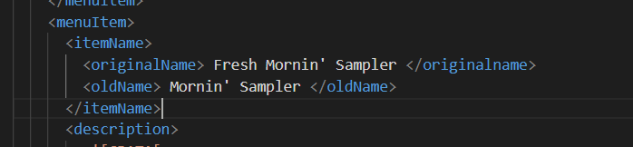
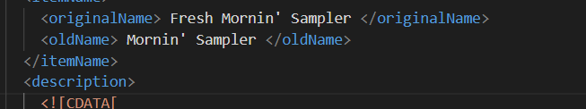
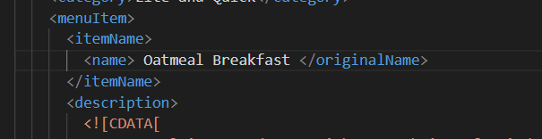
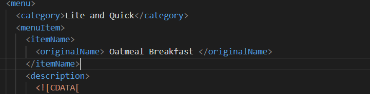
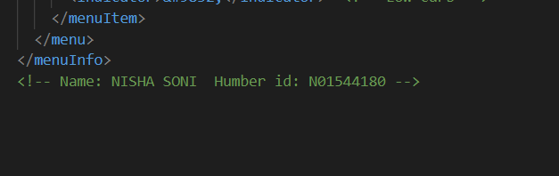
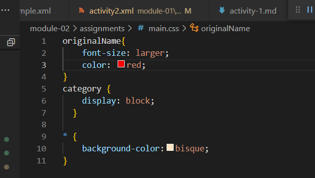
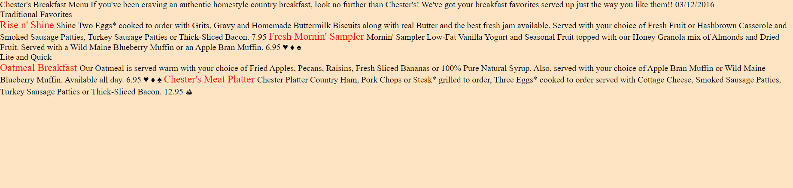

## QUESTION 1
    -- ERROR1. There should not be any space in the name of element. The name of element should be like "elementDate".
    -- ERROR2. The name of the starting tag of the element should match with the ending tag of the root element. so the element type "originalname" shoulb be like "originalName". 

## QUESTION 2 : What is the use of CDATA block in this document?
    -- CDATA  in this document means character data which is not parsed  by xml parser. parser only interprets as character data only.

## QUESTION 4 : Identify prolog, document body, and epilog in the document. Are there any processing instructions?
    -- Prolog : In this document the first line of the code which is xml declaration is prolog which indicated the program that it is a xml file. Here's the part after root element which is menuInfo is document body basically it contains the elements in heirchical tree structure. Now ,the epilog is final comment , in this file it has name and student id in comment section. Finally, for now it does not have any processing instruction but when you add the css it will have the instruction.

## QUESTION 5 :

## IMAGES
* Error 1

* Error 2

* Error 3

* Question 3

* Question 7

    