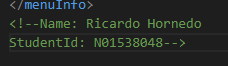

1. There are some errors in the xml document.
    At line 29 there is a space between the words in the element tag so it shows up an error. The element tag should be like single word If there is two words spce should not be present between them.
    At line 49 the element in open tag and close tag are different so it shows error .Both elements in the tags should be same.
    At line 69 is same as above the elements in the tags are not same so they should be same.
2. CDATA is the block of text that XML treat as Character data only. In this document CDATA is used to describe the Item how it is made and what are served with the item.
3. 
4. 
   
   No processing instructions.
5. DTD:
6. no errors: 
7. css: 