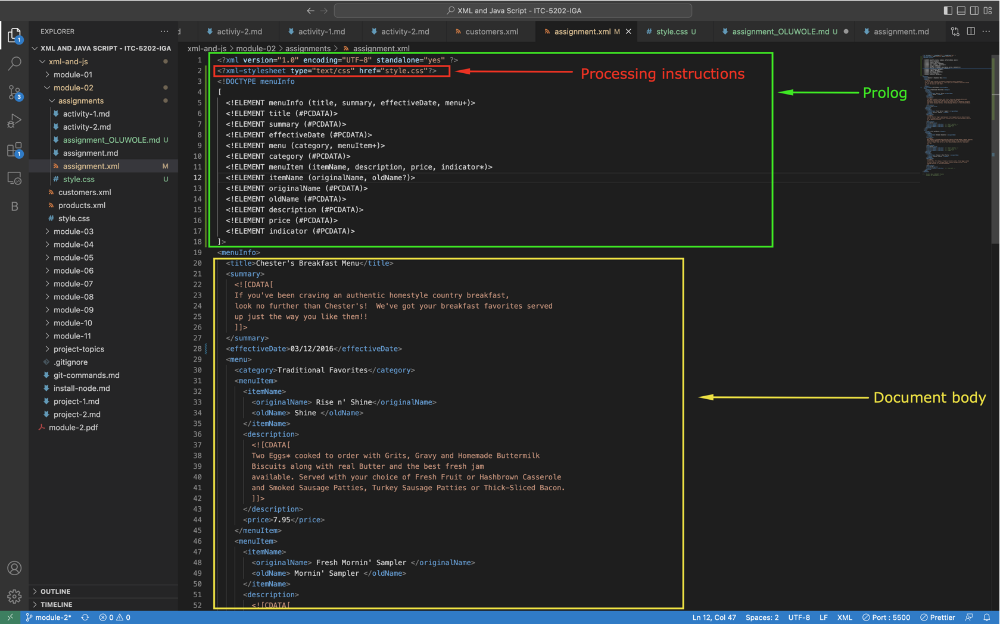
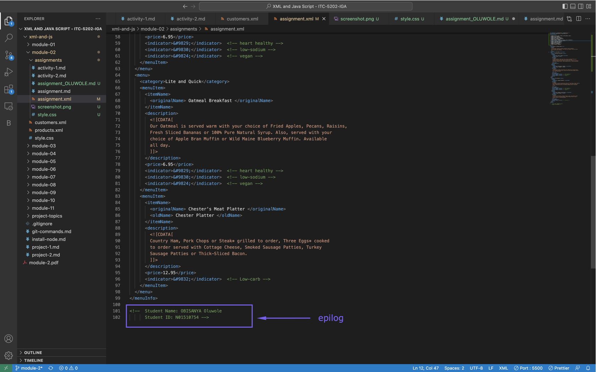

# Assignment 1

1. Are there any errors? Explain the error and fix it.

Yes there are some errors and you can find the error codes and explanations below:

Line 11: <effective Date>03/12/2016</effective Date>
Attribute name "Date" associated with an element type "effective" must be followed by the ' = ' character.

Line 31:  <originalName> Fresh Mornin' Sampler </originalname>
The element type "originalName" must be terminated by the matching end-tag "</originalName>"

Line 51:  <name> Oatmeal Breakfast </originalName>
The element type "name" must be terminated by the matching end-tag "</name>

2. What is the use of CDATA block in this document?

CDATA which stands for "Character Data," is used in this document to specify that the text within the block should be treated as “character data” and not as markup.

3. Add comment line to the end of file which contains you name and student id.

<!--  Student Name: OBISANYA Oluwole
      Student ID: N01510754 -->
is added to the end of the closing tag of the root element as shown in the "screenshot-1"

