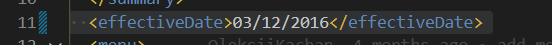

# Assignment 1

1. Open `module-2/assignments/assignment.xml` in your browser. Are there any errors? Explain the error and fix it.

Correction at line 11 
In Effective date there is a space where in tags we do not add space.

Correction at line 31
In the line mentioned above there is an error within line 31 where it should be originalName but in closing tag its originalname.

Correction at line 51
The given tag name was "name" and closing tag was "originalName" so that should is changed to "originalName"

2. What is the use of CDATA block in this document?
Basically in this document we are using CDATA to mention or provide the description of the Items.

3. Add comment line to the end of file which contains you name and student id.

4. Identify prolog, document body, and epilog in the document. Are there any processing instructions?
Prolog: It basically consits of XML declaration and DTD(Document Type Declaration) with comment lines and processing instructions. Prolog informs the browser that the document is marked up as an XML.

Document Body: Is basically present inside the root element.

Epilog: It contains any final comments or processing instructions.

No, there are no processing instructions in the document but if you add any special instructions or you link any css files to the document then that is counted in processing instructions.

5. Add inline DTD for this document.

6. Verify that file is well-formed and valid.

7. Create `style.css` file and link it to the file. Add the following styles to the .css:
- Change font-size of `originalName`
- Display each `category` on the new line
- Add any other css-rule
