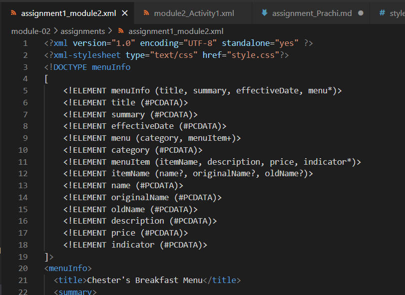
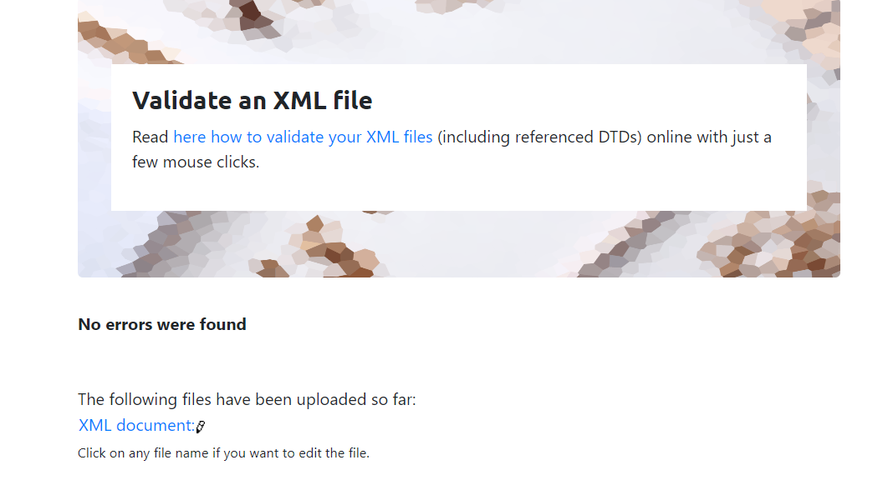

# Assignment 1
# n01530881

1. Open `module-2/assignments/assignment.xml` in your browser. Are there any errors? Explain the error and fix it.

line : 11
description : tag name such as entity can not be seperated by white space
corrected : <effectiveDate>03/12/2016</effectiveDate> 

line : 16
description : xml is case sensitive language so 'originalName' is not same as 'originalname'
corrected : <originalName> Rise n' Shine</originalName>

line : 51
description : opening and closing tag for any entity should be same such as 'name' tag can not be end with 'originalname'
corrected : <name> Oatmeal Breakfast </name>

2. What is the use of CDATA block in this document?

CDATA stands for character data in xml. any type of characters between CADATA tags behaves like normal text and printed as it is written.
Entity such as address, message need this kind of special tag becuase it may contain reserved special characters which holds special meaning in xml.

3. Add comment line to the end of file which contains you name and student id.

4. Identify prolog, document body, and epilog in the document. Are there any processing instructions?

prolog :
<?xml version="1.0" encoding="UTF-8" standalone="yes" ?>

document body :
enclosed between root element tags
<menuInfo> ... <menuInfo>

epilog:
<!-- Name : Prachiben Ka Patel
    Student ID : N01530881
-->

processing instructions:
no processing instructions present

5. Add inline DTD for this document.

6. Verify that file is well-formed and valid.

7. Create `style.css` file and link it to the file. Add the following styles to the .css:
