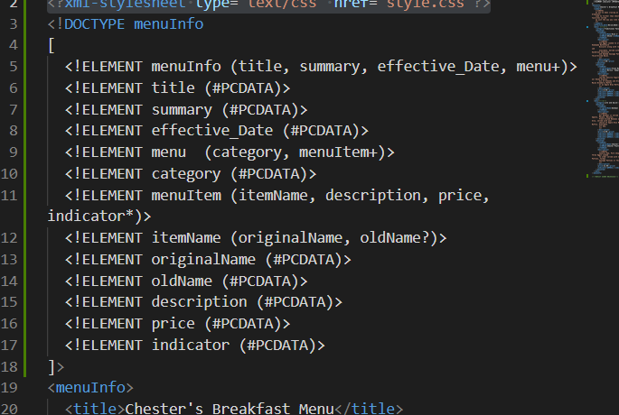
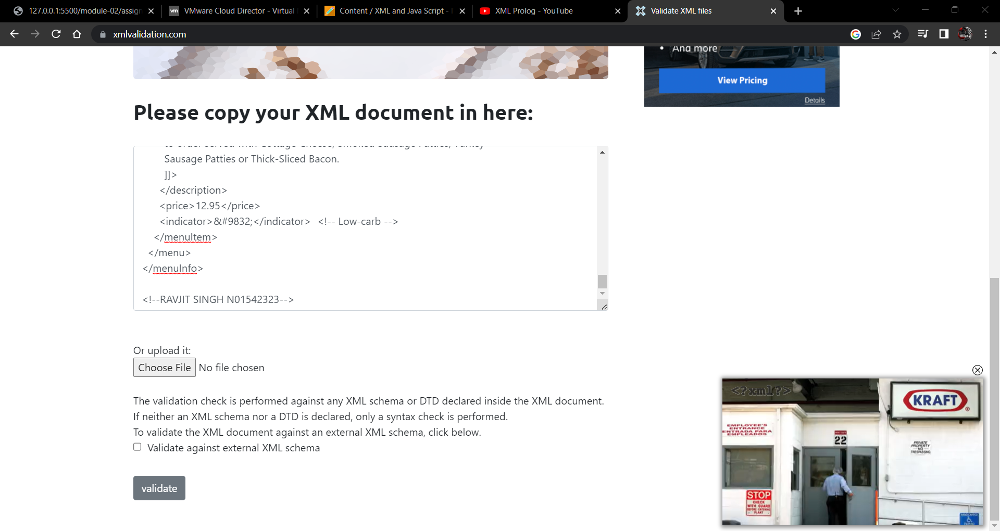

# ASSIGNMENT 1

# ANS 1
1. Declaration of element '<effective Date>...</effective Date>' will cause error because computer treats it as two different entries.It should be declared as '<effectiveDate>...</effectiveDate>' or '<effective_Date>...</effective_Date>'.

2. For some tags in '<menuItem>...</menuItem>', opening and closing tags are not same, in both cases opening and closing tag decalration there is either an error due to case sensitivity and daclaration for opening tag is not close to closing tag.

3. The string values stored in elements '<originalName>...</originalName>' and '<oldName>...</oldName>' are having additional space at the beginning and the end, which seems fine considering in terms of readability but will cause problems while data validation and processing at the back-end.

# ANS 2
CDATA block is specefically used for description tell that whatever is enclosed in 'summary' should be treated as data. As if there is any special characterin it it may create error.

# ANS 3

# ANS 4
Prolog: <?xml version="1.0" encoding="UTF-8" standalone="yes" ?>
Document Body: All the elements between root element is document body:
               <menuInfo>...</menuInfo>
Processing Instructions: <?xml-stylesheet type="text/css" href="style.css"?>

# ANS 5

# ANS 6

# ANS 7
<?xml-stylesheet type="text/css" href="style.css"?>
(style.css file linkedto xml document)