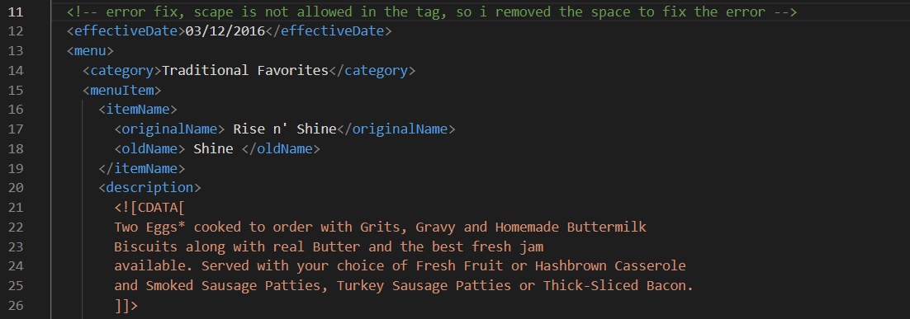
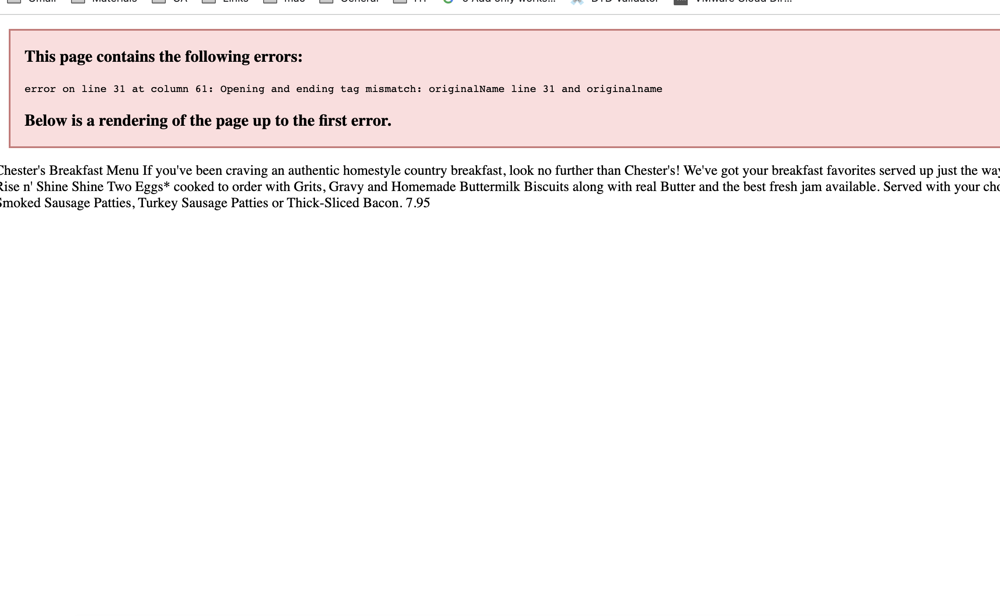
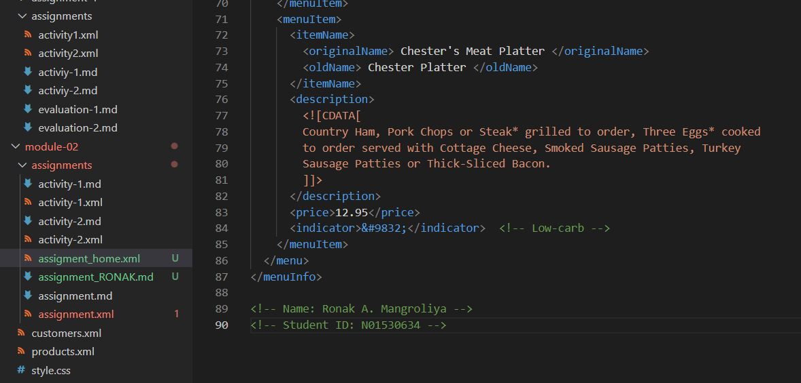
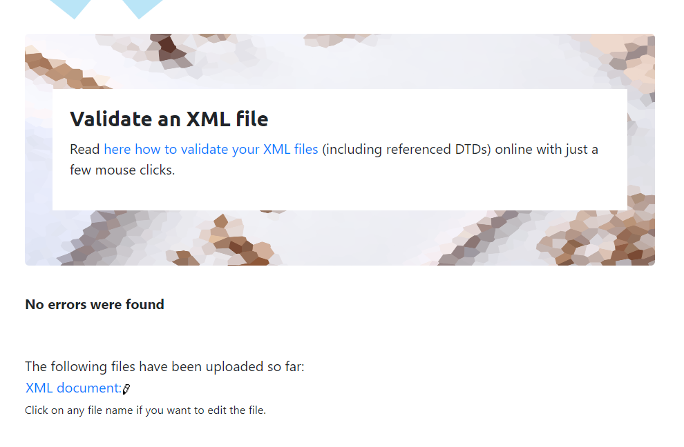
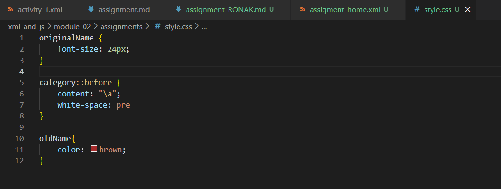

Answer-1.   error-1. 
            error-2. 
            error-3. 

Answer-2.   CDATA is stands for "Character Data" and it means that the data in between these strings includes data that could be
            interpreted as XML markup. as we can see in the document the string content will be interpreted as markup or raw data.

Answer-3.   

Answer-4.   Yes, prolog is available in the document but it only consisted of XML declaration.
            documents body is also available which is starting from the root element.
            epilog is not available in the document.
            processing instructions is not available in the document too.

Answer-5.   DTD is added in the document.

Answer-6.   I validate the assignment_home.xml document. there is no error found.  

Answer-7.    or see style.css file.