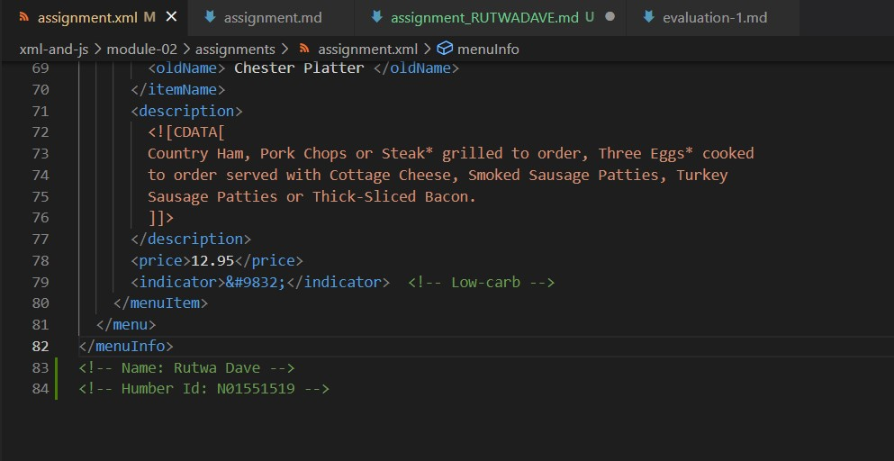
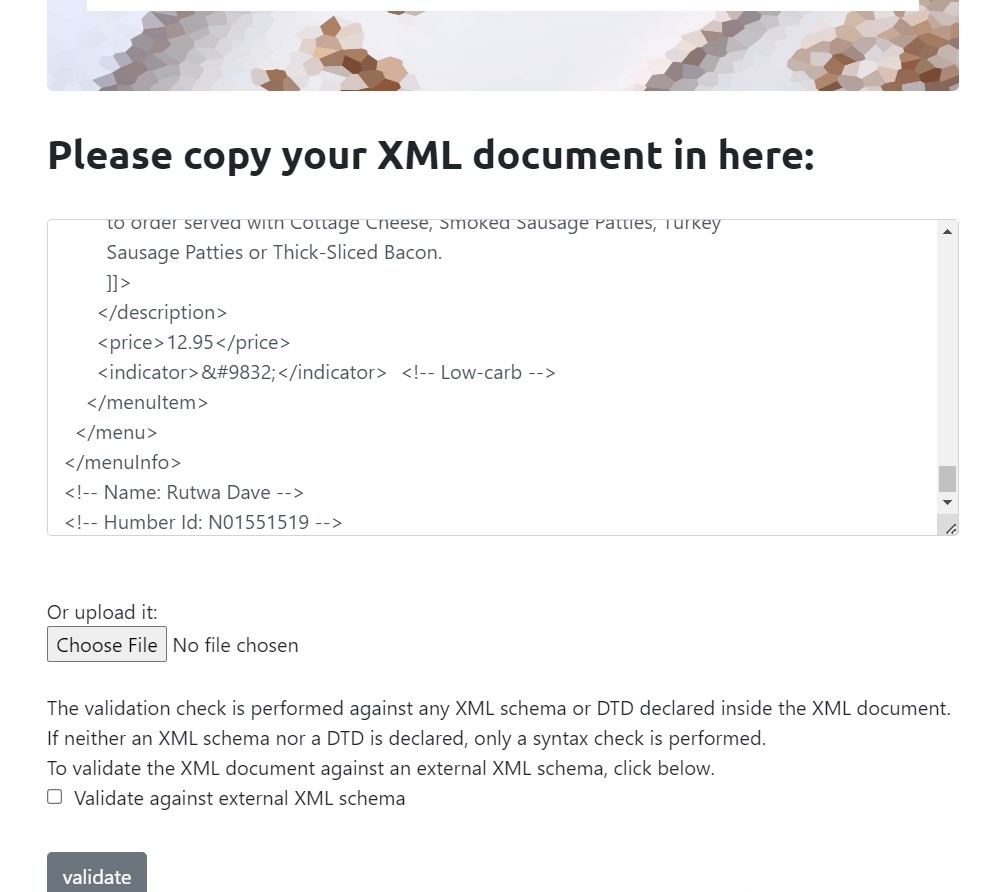

# Assignment 1
# Humber Id:- n01551519 
# Name:- Rutwa Dave

1. Open `module-2/assignments/assignment.xml` in your browser. Are there any errors? Explain the error and fix it.

-> Error 1 - tag name must not have space in between, <effective Date> is not valid, it should be <effectiveDate> as camel case
or <effective_Date> as per choice of developer.
-> Error 2 and 3 - starting and closing tag must be same, it should not vary they needs to be exact same. 
    - Error 2, <originalName> is start tag and <originalname> is closing tag. Tags Should either be named <originalName> or <originalname>
    - Error 3, <name> is start tag  and <originalName> is closing tag. <itemName> contains element <originalName> as inner element so it should come to avoid logical error.

2. What is the use of CDATA block in this document?
-> CDATA blocks in this document are used to give summary of breakfast menu and item descriptions.
-> CDATA block are used in documents as they are interpeted by XML parser as set of characters only. They are not treated as markup.
-> CDATA can also contain markup charcaters and parser will ignore them and take it as string only.

3. Add comment line to the end of file which contains you name and student id.
-> 

4. Identify prolog, document body, and epilog in the document. Are there any processing instructions?
-> Prolog is written before document body, <?xml version="1.0" encoding="UTF-8" standalone="yes" ?> is a prolog before root <menuInfo>
-> Document body starts from where root element begins, it starts from <menuInfo> in assignments.xml file.
-> Id and name added as comment in the end of file is epilog, epilog is final comments adding optional infromation or processing instructions after xml declaration.
-> There are no processing instructions as well. Eg:- refrence to css file for processing.
After we add css file link in document, processing instructions is <?xml-stylesheet type="text/css" href="style.css"?>

5. Add inline DTD for this document.
-> 

6. Verify that file is well-formed and valid.
-> Validating xml document 
-> No errors found 

7. Create `style.css` file and link it to the file.
-> 
