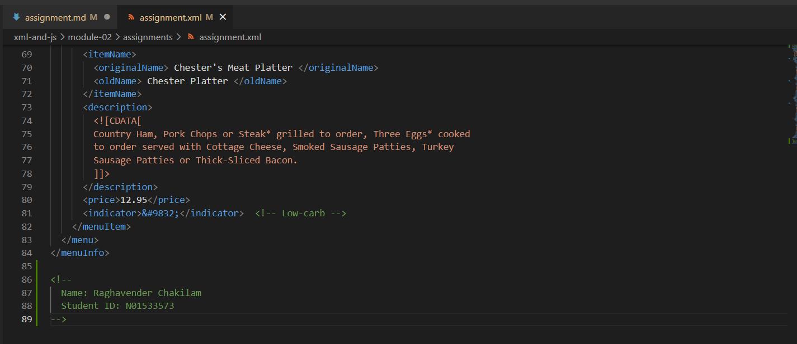
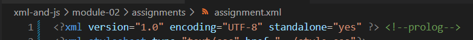
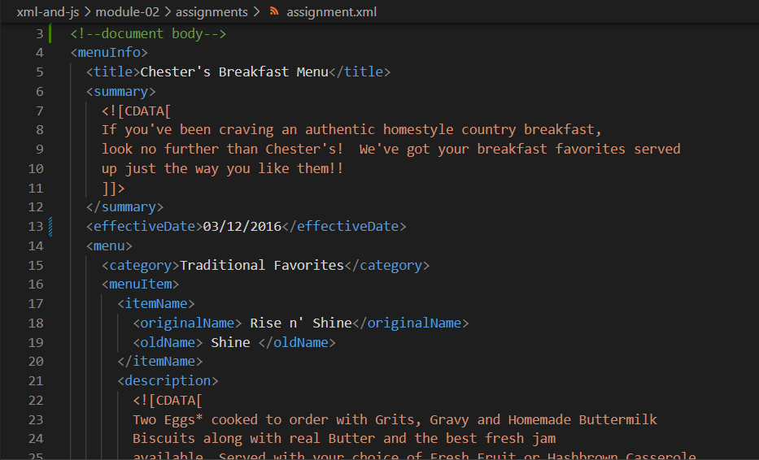
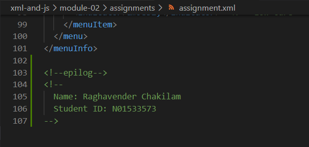
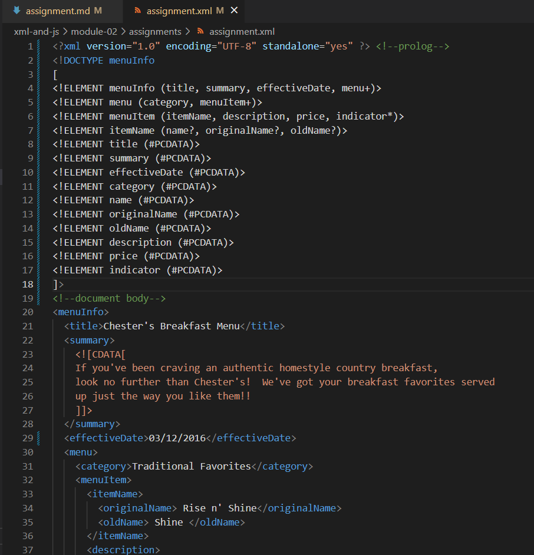
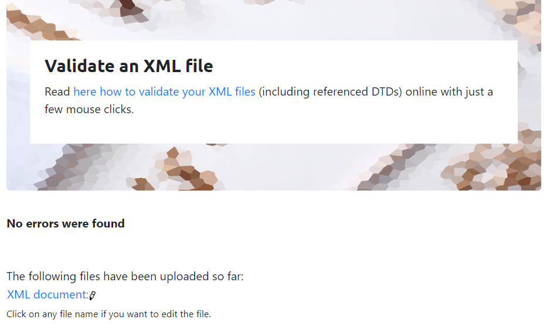
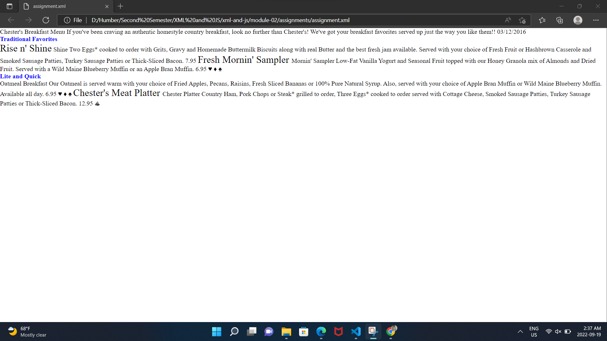

# Assignment 1

1. Open `module-2/assignments/assignment.xml` in your browser. Are there any errors? Explain the error and fix it.
<effective Date> tag is not correctly declared. There should not be any spaces in the tag. The correct format is <effectiveDate>...</effectiveDate>
The ending tag in the following is incorrect <name> Oatmeal Breakfast </originalName>, it should be </name>

2. What is the use of CDATA block in this document?
In this document CDATA block is used to specify the content in summary and description which the XML treats as character data only.

3. Add comment line to the end of file which contains you name and student id.

4. Identify prolog, document body, and epilog in the document. Are there any processing instructions?

There are no processing instructions in the initial document.

5. Add inline DTD for this document.

6. Verify that file is well-formed and valid.

7. Create `style.css` file and link it to the file. Add the following styles to the .css:

- Change font-size of `originalName`
- Display each `category` on the new line
- Add any other css-rule

Create `module-2/assignments/assignment_YOURNAME.md` and add your theory answers. Add screenshots of each step to the file (Refer `module-1/assignments/evaluation-1.md` on how to add image to md file)
