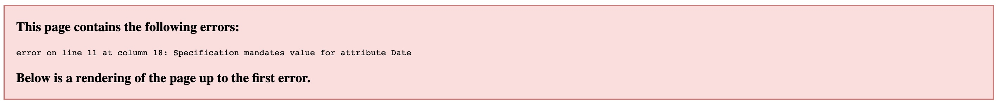
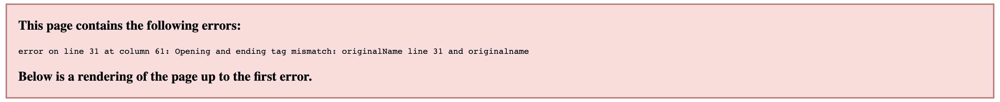
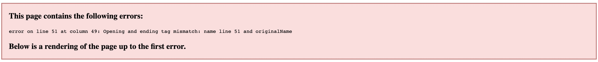
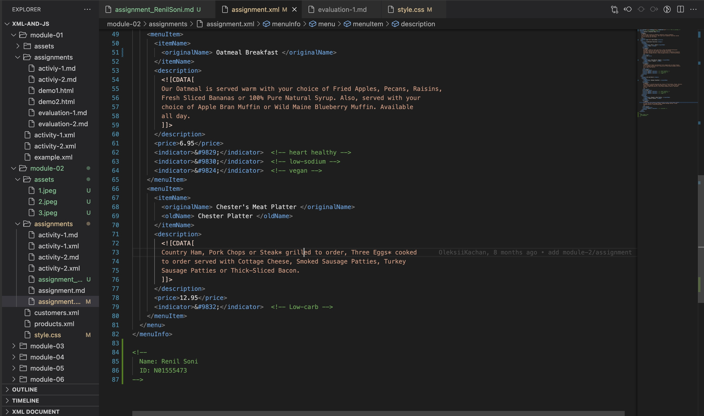
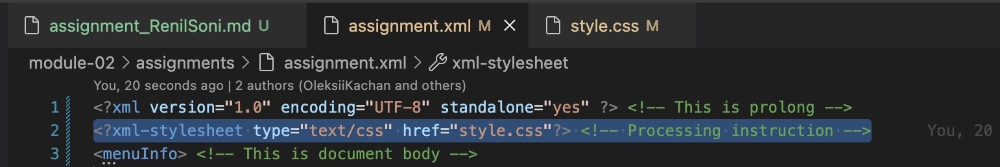
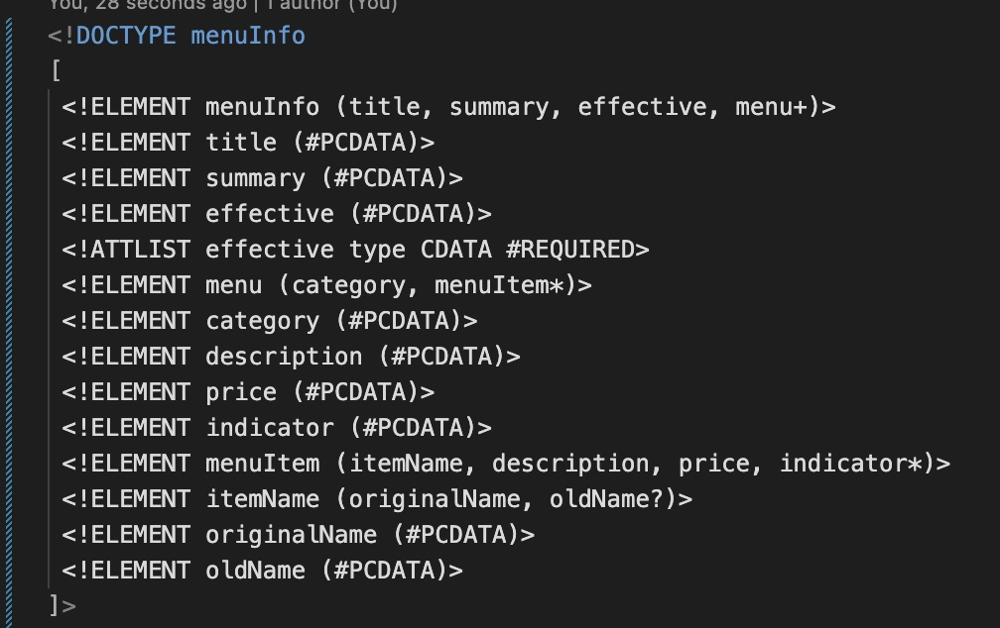
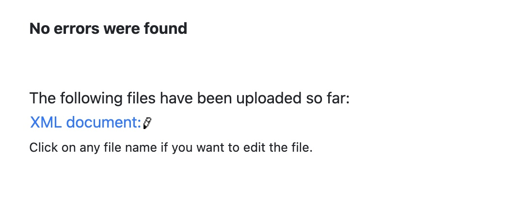
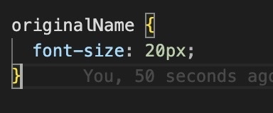
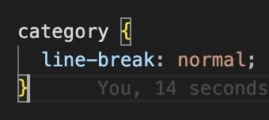
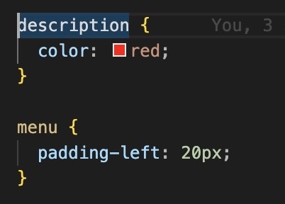

1. Open module-2/assignments/assignment.xml in your browser. Are there any errors? Explain the error and fix it.
    - Yes, there are three errors shown in browser.
    1. First error shows attribute error.
        - 
        - I fixed it using adding type="Date" attribute in effective tag.
    2. Second error shows start and end tag name mismatch.
        - 
        - It was camel notation mistake, I've done that using originalName
    3. Third error shows start and end tag name mismatch.
        - 
        - It was spelling mistake, I've done that using originalName
2. What is the use of CDATA block in this document?
    - CDATA block is used to indicate string which is not parsable.
    - It is used to show XML document and it will be interpreted as set of characters data not markup.
3. Add comment line to the end of file which contains you name and student id.
    - 
    - Added in the assignment.xml file.
4. Identify prolog, document body, and epilog in the document. Are there any processing instructions?
    - 
    - Epilog is considered as any final comments or processing instruction. However, there is one processing information is written in the file and as far as final comments are concerned, there are some comments included in the file for special characters such as heart healthy for &#9829; and so on.
    - No, There is processing instructions written in assignment.xml file. However, in the last question we have to add some css in style.css file and to apply that in assignment.xml file, I've added processing information line just right after prolog.
5. Add inline DTD for this document.
    - 
6. Verify that file is well-formed and valid.
    - 
    - File is well-formed and valid with no errors. I verified it from https://www.xmlvalidation.com/.
7. Create style.css file and link it to the file. Add the following styles to the .css:
    - Change font-size of originalName
        - 
    - Display each category on the new line
        - 
    - Add any other css-rule
        - 